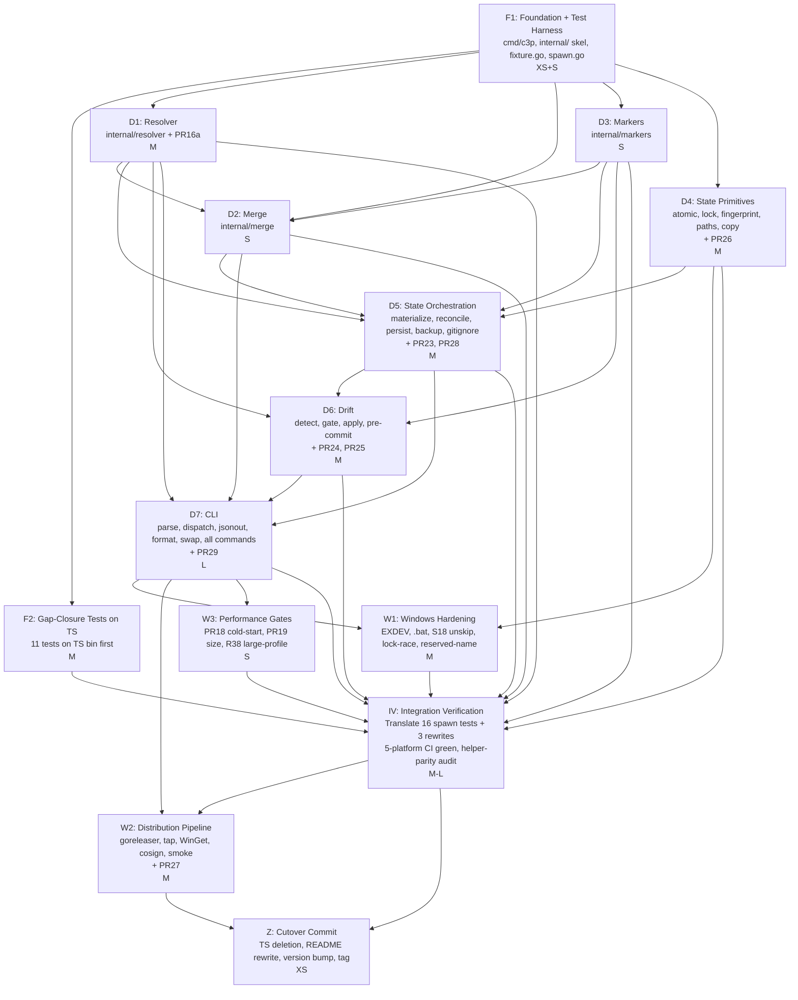

# c3p Go Rewrite — Decomposition (Phase 3)

**Date**: 2026-05-01
**Companion**: `c3p-go-migration.md` (port spec), `c3p-go-migration-advisory-brief.md`, `claude-code-profiles.md` (system spec, frozen behavior contract)

This document records the Phase 3 decomposition convoy's findings and the synthesis that produced the final epic structure. Six lens-specific subagents (bounded-context mapper, dependency analyst, scope sizer, interface designer, STPA control-structure analyst, structural-semantic gap analyst) ran in parallel; their full reports live at `/tmp/decompose/<lens>.md`.

## Summary

The convoy converged on **14 epics**: 1 Foundation, 1 TS-first gap-closure, 7 domain ports, 3 cross-cutting (Windows / distribution / perf), 1 Integration Verification, and 1 Cutover. Three of these are migration-shape epics with no analog in the original greenfield decomposition (`claude-code-profiles-decomposition.md` E1–E7). Three convoy disagreements were resolved (D-go-1, D-go-2, D-go-3). Seven new spec requirements (PR23–PR29) emerged from STPA and are folded in as per-epic acceptance criteria.

## Convoy convergence

All six subagents agreed on:

- **State is the highest-risk epic** — owns cross-platform atomic-rename + locking + reconcile + crash-injection. Cycle-time L, branch-rot risk High. Throwaway prototype on all 3 OSes in week 1 is non-negotiable (carry-over from greenfield's senior-engineer flag).
- **CLI is the second-highest-risk epic** — 50% of source LOC, broadest user-visible surface, intra-package change coupling makes it indivisible. Cycle-time L.
- **Distribution is its own first-class epic** — no greenfield analog; the multi-channel pipeline (Homebrew tap + WinGet + GH Releases + cosign + cross-compile smoke) has zero structural home under `internal/<domain>/`.
- **Windows-first-class is cross-cutting**, not its own epic. Each affected epic carries Windows acceptance criteria; IV runs the Windows matrix gate. Same logic that folded Concurrency into State in the greenfield decomp's D2.
- **Hot-path readiness is a CI-gate concern**, not its own epic. Folds into the Performance Gates epic.
- **`ResolvedPlan` is the load-bearing contract** — must be locked in the first 48h of D1 (carry-over from greenfield P1-7).
- **JSON output centralization (PR3)** is a discipline-at-the-boundary risk that needs a static-analysis CI gate, not just struct discipline.
- **Markers reach into 3 packages** (resolver/state/drift) — promoting it to first-class makes the cross-cutting cost explicit.

## Convoy disagreements (and resolutions)

### D-go-1 — Should the State epic split?

- **Bounded context mapper / Dependency analyst**: keep together (cohesive lock-bracketed mutation surface; greenfield D1 holds).
- **Scope sizer**: SPLIT — 12+ concepts, XL effort, overflow.
- **STPA**: independent on this; the hazard cluster naturally splits into "primitives" (atomic, lock, fingerprint) and "orchestration" (materialize, persist, reconcile, backup).
- **Structural-semantic**: keep together; build-tagged files within `state/` handle platform diversity.

**Resolution**: SPLIT into D4 (State Primitives) + D5 (State Orchestration). Reasons:
- 12+ concepts overflows the 7±2 envelope; the user's velocity preference (single-maintainer) tilts toward smaller-and-more.
- The senior-engineer "throwaway prototype on all 3 OSes" workshop attaches naturally to D4 alone (atomic-rename + lock primitive); orchestration can wait on D4's contracts.
- Scope sizer's split aligns with the spec's PR13 (atomic rename) and PR14 (locking) — both belong to primitives.
- Hazard taxonomy from STPA splits cleanly along the same line: H1/H2 (state-write atomicity, persist+materialize transactional pair) → orchestration; H3/H4 (lock bracketing, Windows PID-recycle) → primitives.

### D-go-2 — Should the CLI epic split?

- **Bounded context mapper / Dependency analyst**: keep together (parse/dispatch/output/format/prompt churn together for every flag tweak; intra-package coupling is high; splitting buys nothing).
- **Scope sizer**: SPLIT three-way (plumbing / read commands / mutating commands).
- **Interface designer**: keep together; `jsonout` is the only sub-component with an independent contract worth carving.
- **Structural-semantic**: keep together; cobra is an implementation detail, not a structural boundary.

**Resolution**: KEEP TOGETHER as single epic D7. Reasons:
- Change coupling is observably high in TS (file-by-file shipping the same flag adds across all 4–6 of these).
- Three-way split would create three PR boundaries that all touch the same files.
- `jsonout` is called out as the **first deliverable** within D7 (week-1 priority) — it's load-bearing for every read verb's tests and benefits from being merged before command authoring starts. But it's a 1-day deliverable, not an epic.
- Single-maintainer cost: three CLI epics produce three rebase storms; one large epic produces one focused PR-cluster.

### D-go-3 — Markers: own epic, fold into State, or fold into Drift?

- **Bounded context mapper**: own epic — coherent ubiquitous language, cross-cutting reach.
- **Dependency analyst**: own epic — small but distinct package; `markers/` import direction is consumer-of-merge, peer-of-state.
- **Scope sizer**: JOIN to State Orchestration (small; cohesive with section-splice).
- **Structural-semantic gap analyst**: own epic (cross-cutting reach into resolver/state/drift makes it semantically first-class).

**Resolution**: OWN EPIC (D3). Reasons:
- 3 of 4 subagents recommend it.
- Cross-cutting reach is real (R44 validation in resolver, R45 splice in state, R46 fingerprint scope in drift). A peer epic forces explicit handoff contracts.
- The package is small (~275 LOC, 62 test assertions) but **load-bearing for cw6 section ownership**, the most recent system-spec addition. Its parser regex is the single source of truth across §12.
- Joining to State Orchestration would dilute D5's domain noun (materialization protocol) with parser concerns.
- Its scope is bounded enough (3 concepts) that "S" effort is realistic.

## Convoy-derived spec patches (PR23–PR29)

STPA surfaced 7 requirements the Phase 2 spec doesn't carry. They are folded in at Phase 4 as per-epic acceptance criteria; the spec's §3 will gain a §3.8 "Convoy-derived requirements" subsection in the same patch where epics are materialized.

| New PR | Burden epic | One-line | Rationale |
|---|---|---|---|
| **PR23** Reconciliation under lock | D5 (State Orchestration) | `.pending/` and `.prior/` reconciliation runs only after `.meta/lock` is acquired | Closes UCA-H6-C: two processes both reconcile race |
| **PR24** Drift snapshot immutability across the gate | D6 (Drift) | Drift report displayed at gate prompt is byte-identical to drift report applied at user's selection | Closes UCA-H7-O: re-detection between display and apply |
| **PR25** Backup notice in JSON under `--quiet` | D6 (Drift) + D7 (CLI) | `--non-interactive --on-drift=discard` emits `backupPath` in JSON even under `--quiet` | Closes UCA-H8-C: silent destruction with no recovery channel |
| **PR26** Windows lock-content release | D4 (State Primitives) | On normal lock release on Windows, unlink the lock file after `UnlockFileEx`; stale-detection treats inaccessible-PID + mtime ≥10 min as stale | Closes UCA-H4-O: lock-file content pollution on Windows |
| **PR27** Goreleaser token rotation cadence | W2 (Distribution) | Tap-write token is fine-grained PAT with ≤90-day expiration; rotation in release runbook | Closes UCA-H12-D: long-lived secret as supply-chain weak point |
| **PR28** Schema-version skew refusal | D5 (State Orchestration) | If `state.json.schemaVersion` > bin's max supported, refuse to write; advisory error to user | Closes UCA-H15-C: data-loss-shaped degradation when reading future state |
| **PR29** `--non-interactive` requires `--on-drift=` | D7 (CLI) | Non-interactive `c3p use` with detected drift requires explicit `--on-drift=` flag; absence → CONFLICT exit | Closes UCA-H8-O: silent default action picked from ambient state |

## Final epic structure

**14 epics**, organized in 5 strata. The dependency graph is below.

### Critical path (longest chain)

`F1 → D1 → D5 → D6 → D7 → IV → W2 → Z` (8 nodes). State Orchestration (D5) and CLI (D7) are the two L-sized epics on the critical path; each is a branch-rot risk per spec R10's 16-week budget.

### Parallelization opportunities

- **Wave A (post-F1)**: D1, D2 (with stub `ResolvedPlan`), D3, D4, F2 can all run concurrently. F2 (gap-closures on TS) is special — runs against the existing TS bin and is fully decoupled from any Go work. Land it early as Phase 2a value.
- **Wave B**: D5 starts when D1 + D4 are stable. D6 starts when D5 + D3 are stable.
- **Wave C**: D7 (CLI) integrates everything. W1 (Windows hardening) parallels D7's tail, since most Windows surface depends on D4 + D7 being stable enough to add platform-conditional code.
- **Wave D**: IV runs the matrix once everything is in. W3 (perf gates) lands alongside IV.
- **Wave E**: W2 (distribution) runs after IV is green. Z is the final commit.

Realistic concurrency ceiling: 4 streams in Wave A, 2 in Wave B, single-stream from D7 onward. Single-maintainer ⇒ practical ceiling is 1–2.

## Per-epic detail

### F1 — Foundation & Test Harness

- **Scope IN**: `go.mod` at repo root (`go/` during rewrite, root post-cutover); `cmd/c3p/main.go` cobra root + dispatch skeleton; `internal/<domain>/` empty subdirs; `internal/errors/` sentinels (`CycleError`, `ConflictError`, `MissingProfile`, `PathTraversal`); Taskfile Go targets; dual-suite CI (`pnpm test` + `cd go && go test ./...`); `tests/integration/helpers/{fixture.go, spawn.go}`; `tests/integration/` scaffold; helper-parity audit framework (PR4).
- **OUT**: any verb logic; release; gap closures.
- **EARS subset**: PR11, PR12, PR4 (test harness), PR20 (CGO=0).
- **Explicit contracts**: `Fixture{ProjectRoot, ExternalRoot, Cleanup() error}`, `RunCli(opts SpawnOptions) (SpawnResult, error)`. Both must be public-surface-equivalent to the TS helpers.
- **Implicit contracts**: each `Fixture` uses `t.TempDir()` (Go) for isolation; never shares state with TS fixtures (closes MH1).
- **Assumptions**: Go 1.22+ available; cobra works under `CGO_ENABLED=0`; GH Actions runners support all 5 platforms.
- **Fitness functions**: every `tests/integration/*_test.go` calls `helpers.EnsureBuilt(t)`; CI runs both suites; helper-parity audit job diffs `fixture.ts` and `fixture.go` public surfaces and fails on divergence.
- **Re-decomp trigger**: if Go fixtures need fundamentally different setup primitives than TS (e.g., process-shared state), the harness boundary is wrong.

### F2 — Gap-Closure Tests on TS

- **Scope IN**: 11 gap-closure tests (PR6 #1–10 + #11 large-profile) authored against the TS bin **first**. Each test must pass on TS before being eligible for Go translation.
- **OUT**: Go translation (lives in IV).
- **EARS subset**: PR6 #1–11, PR6a (PTY deferral), R38 perf gate.
- **Explicit contracts**: each test uses the spawn-only TS harness; output and exit codes match the spec verbatim. Tests that exercise PR16a (#6 path-traversal manifest variant) require the TS impl to reject the manifest — if TS doesn't (existing bug), file a bead and fix TS first per R9.
- **Implicit contracts**: tests are independent — each can be ported to Go in any order during IV.
- **Assumptions**: TS bin is feature-frozen; no churn during F2 authoring.
- **Fitness functions**: all 11 tests green on TS bin; PR coverage matrix in `tests/cli/integration/INDEX.md`.
- **Re-decomp trigger**: if any TS test fails because the TS impl genuinely lacks the behavior (not a test bug), the gap-closure cadence is wrong — fix TS first, treat as Phase 2a deliverable, then resume.

### D1 — Resolver

- **Scope IN**: `internal/resolver/{discover,manifest,walk,paths,resolve,merge_policy,types}.go`; `ResolvedPlan` type; PR16a path-traversal canonicalize-and-reject; PR16 Windows reserved-name guard at `init` time; per-package unit tests for R1–R7, R35–R37.
- **OUT**: Merge logic; FS materialization; argv.
- **EARS subset**: R1–R7, R35–R37, R37a, PR16, PR16a.
- **Explicit contracts**: `ResolvedPlan{schemaVersion=1, profileName, chain, includes, contributors, files, warnings, externalPaths}`; `IncludeRef.kind ∈ {component, relative, absolute, tilde}`; `PathTraversalError`. Lock the type before D2/D3/D5 start consuming it.
- **Implicit contracts**: synchronous, single-goroutine; resolver completes before any consumer; throws sub-classes of `ResolverError`.
- **Assumptions**: project root is on a single filesystem; `os.Getwd()` returns canonical path.
- **Fitness functions**: `resolved_plan_test.go` covers all R-numbered cases; `path_traversal_test.go` covers PR16a's canonicalize-and-reject; `windows_reserved_test.go` covers PR16.
- **Re-decomp trigger**: if `ResolvedPlan` schema churns ≥2× during D1, the boundary between D1 and D2/D3/D5/D7 is wrong — re-open Phase 3 (per STPA RDT-1).

### D2 — Merge

- **Scope IN**: `internal/merge/{merge,deep_merge,concat,last_wins,strategies,types}.go`; strategy registry (R8 deep-merge, R9 concat, R10 last-wins, R11 conflict, R12 hooks-by-event precedence); per-package unit tests.
- **OUT**: Resolver logic; FS IO; markers parsing (delegated to D3).
- **EARS subset**: R8–R12.
- **Explicit contracts**: `MergedFile{path, bytes, contributors[], mergePolicy, destination}`; lex-sorted by `(path, destination)`; one entry per `(relPath, destination)`.
- **Implicit contracts**: pure transformation; no I/O; no goroutines; consumes `ResolvedPlan` read-only.
- **Assumptions**: file content is bytes (no encoding conversion); markers parser from D3 is available.
- **Fitness functions**: `merge_test.go` tabular tests cover R8–R12 cells; `r12_over_r8_test.go` covers the depth-2 hooks carve-out.
- **Re-decomp trigger**: if merge needs to call back into resolver (cycle), the boundary is wrong.

### D3 — Markers

- **Scope IN**: `internal/markers/markers.go` (parser regex, marker writer, render-managed-block); section-ownership types; per-package unit tests for R44–R46.
- **OUT**: Splice logic (lives in D5); fingerprint scope (lives in D6).
- **EARS subset**: R44, R45 (marker parsing only — splice in D5), R46 (fingerprint scope contract — applied in D6).
- **Explicit contracts**: marker regex single source of truth; `parseMarkers`, `renderManagedBlock` exported. Status enum: `valid | malformed | absent`.
- **Implicit contracts**: pure; no I/O. Consumers (D5 splice, D6 fingerprint scope) call through `parseMarkers` only.
- **Assumptions**: `<!-- c3p:vN:begin -->` is the only marker form (versioned); namespace tail support is forward-compatible.
- **Fitness functions**: `markers_test.go` covers all marker variants from §12; `back_compat_test.go` (in IV) covers integration with state.
- **Re-decomp trigger**: if markers needs a cross-cutting state-machine beyond regex parsing (e.g., multiple managed blocks per file), the package is wrong-shaped — re-open (per STPA RDT-6).

### D4 — State Primitives

- **Scope IN**: `internal/state/{atomic,lock,fingerprint,paths,copy}.go`; build-tagged platform locking (`lock_unix.go`, `lock_windows.go`); per-package unit tests + 1-week throwaway prototype on all 3 OSes for atomic-rename + lock semantics.
- **OUT**: Materialize, reconcile, persist, backup, gitignore, state-file writer.
- **EARS subset**: R14a, R16 (atomic-rename mechanics), R39 (copy preserves mode bits), R41–R41c (lock primitive + signal handlers), R43 (read-side lock-free), PR13 (EXDEV), PR14 (LockFileEx), **PR26** (Windows unlink + stale-mtime).
- **Explicit contracts**: `LockHandle{path, pid, acquiredAt, release()}`; `withLock(ctx, options) error` wrapper; `Fingerprint{size, mtimeMs, sha256?}`; `AtomicRename(old, new) error` (returns typed `ErrCrossDevice` for EXDEV).
- **Implicit contracts**: lock release on signal handlers wired by orchestrator (`SwapOptions.SignalHandlers bool` opt-out for tests); Windows lockfile unlinked on normal release; cross-drive rename produces typed error, never silent failure.
- **Assumptions**: project root on single filesystem; `golang.org/x/sys/{unix,windows}` available.
- **Fitness functions**: `lock_test.go` covers acquire/release/stale-PID; `atomic_test.go` covers cross-drive abort; `windows_test.go` covers `LockFileEx` + S15 stale-PID + cross-drive.
- **Re-decomp trigger**: if Windows lock semantics force a separate state machine in D5 (not just a build-tagged primitive), D4 needs to split into POSIX-state + Windows-state (per STPA RDT-3).

### D5 — State Orchestration

- **Scope IN**: `internal/state/{materialize,reconcile,state-file,persist,backup,gitignore}.go`; section-splice using markers parser from D3; per-package unit tests including 2 mandatory crash-injection cases (PR6 #3).
- **OUT**: Lock primitive, atomic-rename primitive (live in D4); detect (lives in D6).
- **EARS subset**: R13, R14, R15, R16a (reconcile), R17, R22b (persist+materialize transactional pair), R23a (backup before discard), R28 (.gitignore writer), R42 (graceful state degrade), R44 R45 (section splice), PR2 (timestamp format), **PR23** (reconcile-under-lock), **PR28** (schema-skew refusal).
- **Explicit contracts**: `StateFile{schemaVersion, activeProfile, materializedAt, resolvedSources, fingerprint, externalTrustNotices, rootClaudeMdSection?, sourceFingerprint?}`; `materialize(plan, merged) error`; `reconcile(...) error` callable only under lock; `persist(...) error` (transactional pair).
- **Implicit contracts**: all state-mutating calls are inside the locked region; reconcile is the first action after lock acquire (PR23); state writes use atomic-rename via D4.
- **Assumptions**: D4 primitives stable; D3 markers parser stable; `t.TempDir()` for tests.
- **Fitness functions**: `crash_recovery_test.go` (2 mandatory cases); `state_format_test.go` (PR2 byte-identity); `schema_skew_test.go` (PR28); `reconcile_under_lock_test.go` (PR23).
- **Re-decomp trigger**: if persist or materialize needs to bypass the pending/prior protocol for any verb beyond use/sync/persist, the materializer's interface doesn't generalize (per STPA RDT-2).

### D6 — Drift

- **Scope IN**: `internal/drift/{detect,gate,apply,pre-commit,types}.go`; section-aware drift via D3 markers; `--non-interactive` codepath; per-package unit tests.
- **OUT**: Hook installation (lives in D7's commands); state writes (delegated to D5 via persist).
- **EARS subset**: R18–R25, R25a, R26 (gate states), R46 (section-only fingerprint scope), **PR24** (drift snapshot immutability), **PR25** (backup notice on quiet/JSON).
- **Explicit contracts**: `DriftReport{schemaVersion, active, fingerprintOk, entries[], scannedFiles, fastPathHits, slowPathHits, warning}`; `decideGate(input GateInput) → GateOutcome`; `applyGate(choice, ...) error`; `GateChoice ∈ {discard, persist, abort, no-drift-proceed}`.
- **Implicit contracts**: detect is lock-free (R43); apply is inside the locked region; the `DriftReport` shown at the prompt is the same one applied at user's selection (PR24); pre-commit warn always exits 0 (R25 fail-open).
- **Assumptions**: D5 persist + backup primitives stable; D3 markers parser stable.
- **Fitness functions**: `drift_test.go` covers detect taxonomy (PR6 #8); `gate_test.go` covers discard/persist/abort + non-interactive; `pre_commit_test.go` covers fail-open; `drift_snapshot_immutability_test.go` (PR24); `non_interactive_backup_notice_test.go` (PR25).
- **Re-decomp trigger**: if persist requires reaching into resolver state (not just D5's atomic-rename), the D5↔D6 boundary is wrong (per STPA RDT-4).

### D7 — CLI

- **Scope IN**: `internal/cli/` — parse, dispatch, output, format, prompt, exit, preview, plan-summary, suggest, `jsonout/` (PR3 — week-1 deliverable), service/swap, all 13 command handlers (init, use, sync, list, status, drift, diff, new, validate, hook, doctor, completions, hello), help template; per-package unit tests; static-analysis CI gate forbidding `json.Marshal` outside `jsonout/`.
- **OUT**: Resolver/Merge/State/Drift internals; release pipeline.
- **EARS subset**: R29–R34, R40, R3 risk (cobra help template), PR3 (deterministic JSON), **PR29** (--non-interactive requires --on-drift=).
- **Explicit contracts**: `Command` discriminated union; `GlobalOptions`; `ExitCode ∈ {0,1,2,3}`; `OutputChannel{print, json, warn, error, phase}`; `internal/cli/jsonout` is the only JSON marshaller in the codebase.
- **Implicit contracts**: every mutating verb wraps its critical section in `withLock` (delegating to D4); `--json` silences `print/warn`; mutual-exclusion `--json` × `--quiet` enforced at parse; SIGINT during `--wait` releases the goroutine.
- **Assumptions**: D1–D6 contracts stable; cobra custom help template is configurable enough to match TS bytes (R3 risk).
- **Fitness functions**: `exit_codes_test.go`, `json_roundtrip_test.go` (per-verb byte-equality including PR2 timestamp format), `help_version_test.go` (cobra help bytes), `non_interactive_required_test.go` (PR29), `jsonout_lint.sh` (CI step grepping for `json.Marshal` outside `jsonout/`).
- **Re-decomp trigger**: if `--non-interactive` requires structural changes to argv parser AND gate state machine that aren't expressible as a single flag, non-interactive is its own bounded context (per STPA RDT-5).

### W1 — Windows Hardening

- **Scope IN**: native pre-commit hook companion `pre-commit.bat` (PR15) — bytes pinned at first ship; EXDEV cross-drive abort wired through D4 (PR13); reserved-name guard at init time (PR16, leveraging D1's resolver guard); S18 unskipped (PR6 #4); Windows file-lock race test (PR6 #5); `windows_test.go` Windows-only test bundle; `core.hooksPath` interaction with `.bat` documented; CI matrix includes `windows-latest`.
- **OUT**: lock primitive itself (D4); rename primitive itself (D4); resolver path canonicalization (D1).
- **EARS subset**: PR13, PR15, PR16, PR17, PR6 #4, PR6 #5.
- **Explicit contracts**: `pre-commit.bat` bytes once shipped (frozen at first version); `core.hooksPath` documentation gives users an escape hatch.
- **Implicit contracts**: Windows pre-commit hook fail-open semantics match POSIX; Go's `os.Rename` cross-drive returns typed error from D4.
- **Assumptions**: GitHub Actions `windows-latest` available; `golang.org/x/sys/windows` available.
- **Fitness functions**: `windows_test.go::TestS18`, `::TestFileLockRace`, `::TestCrossDriveAtomicRenameAborts`; `pre_commit_bat_byte_test.go` (after first ship).
- **Re-decomp trigger**: if Go's `os.Rename` on Windows produces a third failure mode beyond success/EXDEV, the entire atomic-rename invariant fails on Windows — re-open Phase 3 + system spec R16 (per STPA RDT-7).

### W2 — Distribution Pipeline

- **Scope IN**: `.goreleaser.yaml`; `release.yml` GitHub Action keyed off `v*` tags; `htxryan/tap` Homebrew formula automation (human-approve PRs, minimal-scope token); WinGet manifest scaffold (`htxryan.c3p`); GH Releases with SHA256 + cosign signing (PR8.3 SHALL); cross-compile smoke test (PR8.5 — runs `./c3p --version` per artifact via qemu-user-static or runner matrix); `npm deprecate` runbook; **PR27** token rotation cadence ≤90 days.
- **OUT**: any source code; CI runners (lives in F1).
- **EARS subset**: PR8 (incl. PR8.1 tap auto-merge disabled, PR8.3 cosign SHALL, PR8.5 smoke), PR9 (npm deprecate), PR10 (goreleaser), **PR27** (token rotation).
- **Explicit contracts**: artifact name pattern `c3p_${version}_${os}_${arch}.{tar.gz,zip}`; SHA256 + cosign signature attached.
- **Implicit contracts**: human-approve required on tap PRs; token is fine-grained PAT, scope = tap-write only; signing failure aborts the workflow.
- **Assumptions**: Homebrew tap repo bootstrapped (one-shot human prerequisite); WinGet registry accepts manifests; goreleaser-action stable.
- **Fitness functions**: `release.yml` dry-run; cosign verification step; smoke-test exit codes.
- **Re-decomp trigger**: if WinGet review process requires per-release manual changes that can't be templated, distribution must split (Homebrew automated vs WinGet manual).

### W3 — Performance Gates

- **Scope IN**: PR18 cold-start methodology (10 runs, discard min/max, mean of remaining 8) implemented in CI; PR19 binary-size gate (≤15 MB); R38 large-profile perf test (gap closure #11) wired into CI.
- **OUT**: source-level optimization; build-tagged platform code (D4).
- **EARS subset**: PR18, PR19, R38, PR6 #11.
- **Explicit contracts**: `perf_test.go::TestColdStart`, `::TestBinarySize`, `::TestLargeProfile`. Each runs in CI on every PR (size on every build; cold-start nightly + on perf-impacting paths).
- **Implicit contracts**: mean-of-middle-8 methodology immune to single-run noise; thresholds are platform-class (developer-laptop 25 ms vs CI runner 50 ms).
- **Assumptions**: `c3p --version` is a stable benchmark target (no I/O beyond cobra parse).
- **Fitness functions**: `perf_test.go` itself; PR18 regression detected within 1 day of merge.
- **Re-decomp trigger**: if PR18 mean-of-middle-8 still flakes under load, methodology needs revisiting; not a structural decomposition issue.

### IV — Integration Verification

- **Scope IN**: translate all 16 spawn-based tests from `tests/cli/integration/` into Go (`tests/integration/*_test.go`); rewrite the 3 internal-import tests (style-snapshots, skim-output, sigint) as spawn-only; translate the 11 gap-closures from F2 into Go; helper-divergence audit signoff; full 5-platform CI matrix green; PR2 + PR3 byte-equality verification suite; cross-cutting Windows acceptance verification.
- **OUT**: per-domain unit tests (live with their owning epic); release artifacts (W2).
- **EARS subset**: PR1, PR4, PR5, PR6, PR7. Acts as the cross-cutting acceptance gate.
- **Scope level**: **MEDIUM-LARGE**. Composition contracts (lock+rename+state-write, reconcile+detect+applyGate, materialize-splice+state-write transactional pair) push beyond LIGHT; absence of network/IPC/distributed surface keeps short of FULL. Allow 1.5–2 cycles + 0.5 buffer for first-time Windows kill-injection harness.
- **Contracts under test** (every cross-epic interface from §interfaces above):

| # | Source epic | Target epic | Contract | Type | Test |
|---|---|---|---|---|---|
| 1 | D1 Resolver | D2/D5/D6/D7 | `ResolvedPlan` schema | data | `resolved_plan_provenance_test.go` |
| 2 | D2 Merge | D5 | `MergedFile` shape + ordering | data | `merge_integration_test.go` |
| 3 | D3 Markers | D5/D6 | parser regex single source of truth | data | `markers_test.go` + `back_compat_test.go` |
| 4 | D4 State Primitives | D5/D7 | `LockHandle`, `withLock`, atomic-rename, EXDEV | composition | `concurrent_test.go`, `sigint_test.go`, `windows_test.go::TestCrossDrive` |
| 5 | D5 State Orchestration | D6/D7 | `StateFile` schema, persist+materialize transactional pair, reconcile-under-lock | composition | `crash_recovery_test.go`, `reconcile_under_lock_test.go` |
| 6 | D6 Drift | D7 | `DriftReport`, `decideGate`, `applyGate` | behavioral | `gate_matrix_test.go`, `drift_snapshot_immutability_test.go` |
| 7 | D7 CLI | shell | exit codes, JSON byte-equality | behavioral + data | `exit_codes_test.go`, `json_roundtrip_test.go` |
| 8 | D7 CLI | git pre-commit hook | hook bytes (R25a) | data (frozen) | `hook_byte_equality_test.go` |
| 9 | W1 Windows | D7/git hook | `pre-commit.bat` companion | data (frozen at first ship) | `pre_commit_bat_byte_test.go` |
| 10 | W2 Distribution | release artifacts | cosign signature, smoke test, archive shape | data | `release.yml` workflow + dry-run |
| 11 | F1 Test Harness | every test | `Fixture` + `RunCli` semantic equivalence with TS | composition | `helper_parity_audit.sh` (CI step) |

- **Instruction**: this epic goes through the full cook-it pipeline (plan → work → review → polish). The plan phase produces tasks that test the cross-epic contracts above. If integration tests find cross-boundary failures, create bug beads with deps to the originating epics.

### Z — Cutover Commit

- **Scope IN**: single commit that removes `src/`, `dist/`, `node_modules/`, `package.json`, `pnpm-lock.yaml`, `tsconfig*.json`, `vitest.config.ts`; promotes Go from `go/` to repo root; rewrites README to reflect Go install paths; bumps version to 1.0.0; triggers `npm deprecate claude-code-config-profiles` runbook.
- **OUT**: any behavior change.
- **EARS subset**: PR9, PR11, PR21, PR22.
- **Explicit contracts**: branch protection prevents tagging from cutover commit until CI is green; merge commit re-runs the full matrix before tag is pushed (PR22).
- **Implicit contracts**: irreversibility — once tagged, only via re-issue.
- **Assumptions**: IV is green; W2 has dry-run validated.
- **Fitness functions**: post-merge CI green; tag job sees CI green.
- **Re-decomp trigger**: none — cutover is the final epic.

## Multi-criteria validation

For each epic:

| Epic | Structural (acyclic, low coupling) | Semantic (stable bounded context, coherent language) | Organizational (single owner, ≤9 concepts) | Economic (modularity > coordination) |
|---|---|---|---|---|
| F1 | ✓ | ✓ (Foundation noun) | ✓ (11 concepts; checklist-heavy) | ✓ |
| F2 | ✓ | ✓ (Gap-closure noun, TS-first cadence) | ✓ (11 tests; checklist) | ✓ (independent shippable progress) |
| D1 | ✓ | ✓ (Resolution noun) | ✓ (9 concepts) | ✓ |
| D2 | ✓ (pure consumer of D1+D3) | ✓ (Strategy noun) | ✓ (7) | ✓ |
| D3 | ✓ (peer of D1/D2) | ✓ (Section ownership noun) | ✓ (3) | ✓ (cross-cutting reach makes peer-epic right) |
| D4 | ✓ | ✓ (Primitives noun) | ✓ (6) | ✓ |
| D5 | ✓ | ✓ (Orchestration noun) | ✓ (8) | ✓ |
| D6 | ✓ | ✓ (Drift noun) | ✓ (7) | ✓ |
| D7 | ✓ | ✓ (CLI noun) | ⚠ (12+ concepts, but change coupling justifies) | ✓ (split would create rebase storms) |
| W1 | ✓ | ✓ (Windows hardening noun, cross-cutting) | ✓ (7) | ✓ |
| W2 | ✓ | ✓ (Distribution noun, no domain home) | ✓ (6) | ✓ |
| W3 | ✓ | ✓ (Performance gate noun) | ✓ (5) | ✓ |
| IV | ✓ | ✓ (Integration verification noun) | ⚠ (10+ tests-to-translate, but mostly mechanical) | ✓ (cross-cutting-only home) |
| Z | ✓ | ✓ (Cutover noun) | ✓ (6, mostly checklist) | ✓ |

Two epics carry a yellow flag (D7 CLI, IV) — both are deliberate: D7 because intra-package change coupling forbids the split; IV because the cross-cutting nature is the point.

## Processing order (recommended)

| Slot | Epic | Rationale |
|---|---|---|
| 1 | F1 | Universal blocker; module + harness must exist |
| 1 (parallel) | F2 | Independent of any Go work; runs against TS bin |
| 2 | D1 | `ResolvedPlan` is the load-bearing seam; lock the type |
| 2 (parallel) | D2, D3, D4 | Independent given D1 stubs; D4 = throwaway prototype week |
| 3 | D5 | Needs D1 + D4; orchestration on top of primitives |
| 3 (parallel) | D6 | Needs D5 fingerprint + D3 markers; can start with stubs |
| 4 | D7 | Composes everything; integration point |
| 5 | W1 | Cross-cutting hardening on D4 + D7 |
| 5 (parallel) | W3 | Performance gates on built D7 |
| 6 | IV | All-platforms matrix; helper-parity audit; PR2/PR3 verification |
| 7 | W2 | Release pipeline only after IV green |
| 8 | Z | Final commit |

## Open questions remaining

1. **Build tool decision** — current branch is `ci/taskfile-alignment` (Taskfile). F1 extends Taskfile for Go targets; confirm vs `mage`/`Makefile`.
2. **Cobra confirmed?** — implied by R3 custom help template. If `urfave/cli` or hand-rolled, D7's parser shape changes.
3. **`htxryan/tap` repo bootstrap** — W2 deliverable or one-shot human prerequisite? Recommend prerequisite (single human step before W2 starts).
4. **`--non-interactive` shape** — flag, `CI=true` env detection, or both? PR29's text uses "OR"; confirm "both" is acceptable.
5. **F2 Phase 2a publishing** — does F2 land in `main` (via PR) without a tagged release, or is it batched with the cutover? Recommend land continuously (per-PR via the rewrite branch).
