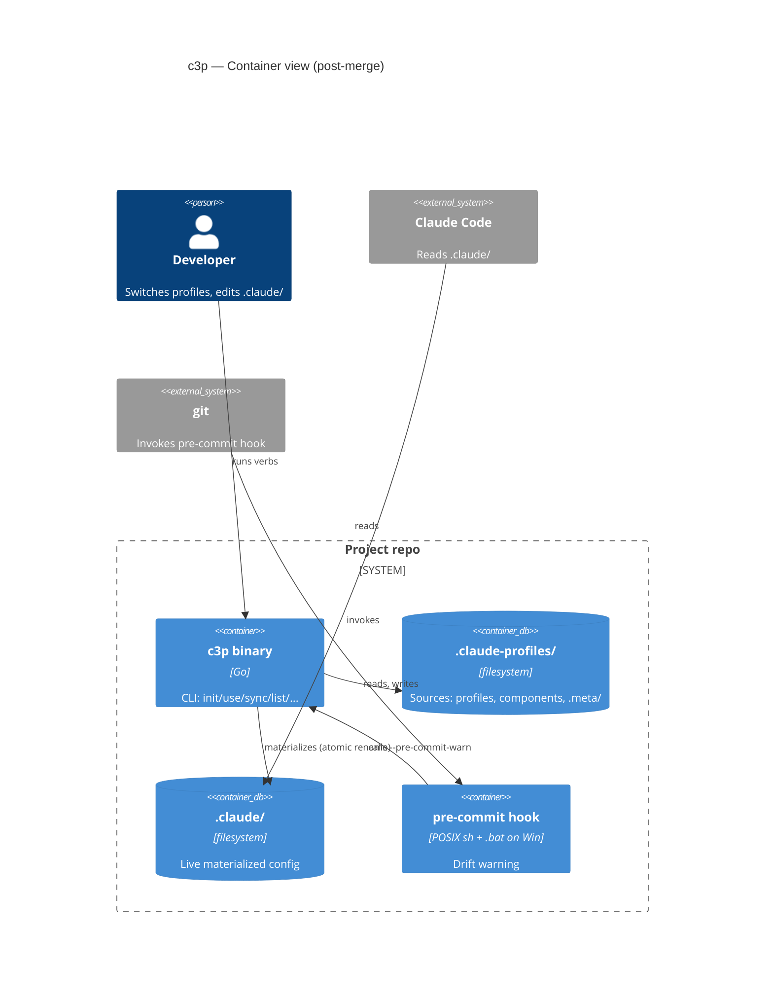
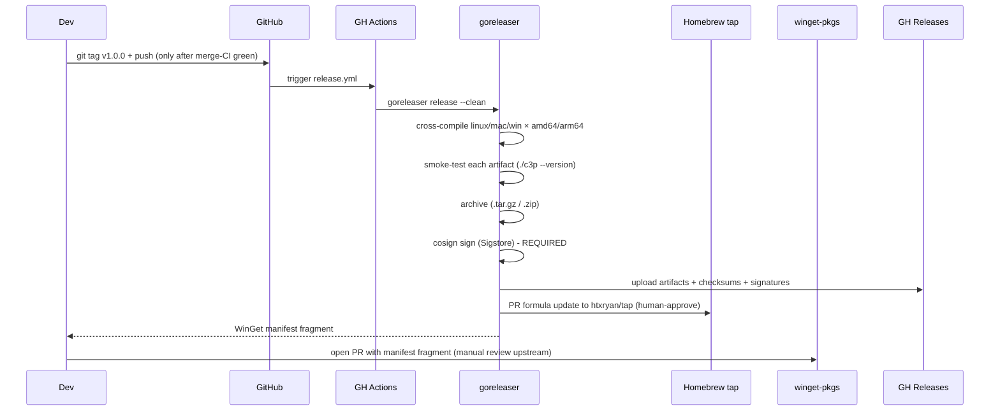
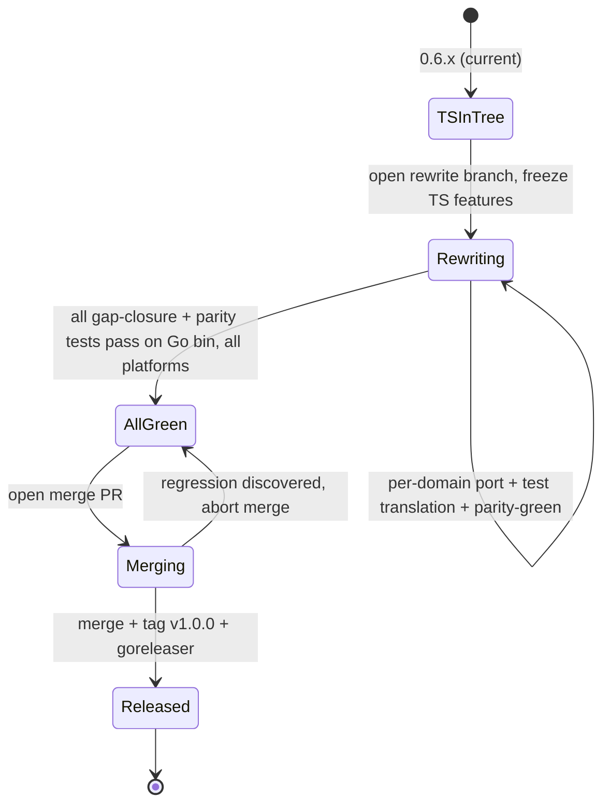

# c3p Go Rewrite — Port Specification

**Status**: Draft v2 (Phase 2 of architect skill, post-advisory revision)
**Date**: 2026-05-01
**Owner**: Ryan Henderson
**Companion**: `claude-code-profiles.md` (system spec, behavior contract — unchanged)

## 1. Problem & Vision

`claude-code-config-profiles` (c3p) is currently a TypeScript CLI. It is **pre-launch with zero users** — the npm 0.6.0 publish exists but has not been adopted. There is no production constituency to protect, no deprecation runway to manage, no migration storyline to write. The rewrite is a clean replacement.

Two motivations push the implementation language to Go:

1. **First-class Windows.** Today the pre-commit hook is POSIX-shell only (`scenarios.test.ts:S18` is `skipIf(win32)`). Atomic-rename and file-locking primitives have not been validated end-to-end on Windows. A Go binary opens the door to a native Windows hook, `LockFileEx`-based locking via `golang.org/x/sys/windows`, and a Windows distribution channel (WinGet).
2. **Hot-path readiness.** The current 50–100 ms Node cold start is acceptable for human-driven verbs but caps the design space for *future* features that invoke the bin per-file or per-event (file watching, large monorepo profile resolution, hooks-from-shell-prompts). A Go binary cold-starts in ~5 ms. This is **not** a daemonization argument — daemonization (if pursued) is a separate post-1.0 client/server architectural decision. Hot-path readiness here is specifically about the per-invocation latency budget that gates per-file invocation patterns.

The system **behavior contract** (CLI surface, file formats, exit codes, hook bytes) is **frozen** for the duration of the rewrite. The system spec at `docs/specs/claude-code-profiles.md` (R1–R46) is the contract Go must satisfy.

### 1.1 Alternatives Considered

| Option | Solves Windows? | Solves cold start? | Cost | Verdict |
|---|---|---|---|---|
| Go pre-commit hook helper only (Node bin stays for everything else) | Partial (hook only) | No | Two-runtime install matrix, ongoing | Insufficient: doesn't enable hot-path features |
| Bun self-contained binary | Partial (some Win primitives are still Node-shaped) | Partial (~30 ms) | Bun's Windows signal/fork/locking primitives are less mature than Go's | Insufficient: Windows story not credible |
| Node SEA (single-executable application) | Partial | No (cold start unchanged) | ~60 MB binary; same Node startup tax | Insufficient: doesn't move either needle |
| Full Go rewrite (chosen) | Yes (native Windows everything) | Yes (~5 ms) | One-time port effort | Selected |

### 1.2 Working Assumptions

- TS code and TS tests stay in-tree during the rewrite (long-running branch, single merge at completion). They serve as the parity reference: each TS spawn-based test is translated to Go before the corresponding TS source is removed.
- "1.0.0" is just a version tag — there is no announcement, no deprecation event, no migration window. When the Go bin passes the parity gate on all platforms, the rewrite branch merges and 1.0.0 ships.
- The npm package will not be updated again. The final state is: archive or unpublish `claude-code-config-profiles` on npm; the only install paths are Homebrew, WinGet, GitHub Releases, and `go install`.

## 2. Glossary (delta over system spec)

| Term | Definition |
|---|---|
| **TS bin** | Existing `dist/cli/bin.js`. Lives in-tree during the rewrite as the parity reference; deleted at merge time. |
| **Go bin** | New `c3p` Go binary. Single static file ≤15 MB, built with `CGO_ENABLED=0` for trivial cross-compile. |
| **Behavior contract** | The set of system-spec requirements R1–R46 plus every spawn-level assertion in `tests/cli/integration/`. The Go bin must satisfy this set. |
| **Parity test suite** | The Go-translated version of `tests/cli/integration/`. Lives at `tests/integration/` post-merge, written in Go, runs `go test ./tests/integration/...` against the built Go bin. |
| **Gap-closure tests** | New tests filling identified holes in spawn-level coverage of the system spec. Written during the rewrite; run on the TS bin first to validate the test, then translated. |
| **Pre-commit hook bytes** | Frozen by R25a. Stays as a POSIX `#!/bin/sh` script; on Windows the Go bin installs a `.bat` companion with equivalent semantics. The POSIX bytes do not change. |
| **First-class Windows** | Windows is a tier-1 platform: full integration suite passes on a Windows runner, native pre-commit installable on Windows, file locking works under contention, atomic rename works across drive boundaries (or fails with a clear error), and S18 is unskipped. |
| **Hot-path readiness** | A bounded per-invocation latency: ≤25 ms cold start (mean over 10 runs, see PR18) and ≤15 MB binary. Enables per-file invocation patterns. Not a commitment to daemonization. |

## 3. Port-Specific EARS Requirements

These are additive over R1–R46 (which remain in force).

### 3.1 Behavior Parity
- **PR1 (U)**: The Go bin shall pass every assertion in `tests/cli/integration/` (the spawn-based subset enumerated in §6 below). Behavior is byte-identical to the TS bin on stdout/stderr/exit-code/disk state for every input the parity suite exercises.
- **PR2 (U)**: The on-disk format of `.claude-profiles/.meta/state.json`, the pre-commit hook script bytes (R25a), profile manifest schema (R35), and the `.gitignore` entries written by `c3p init` (R28) shall be byte-identical between TS and Go bins. Specifically: timestamps in `state.json` shall use ISO-8601 with exactly 3 decimal fractional seconds and a `Z` suffix (e.g., `2026-05-01T12:34:56.789Z`), matching JavaScript `Date.prototype.toISOString()` output. The Go impl must explicitly format with this layout; `time.RFC3339` and `time.RFC3339Nano` do not match.
- **PR3 (U)**: `--json` output shall be byte-equivalent between TS and Go for every read verb (`list`, `status`, `drift`, `diff`, `doctor`). Field names, field ordering, value shapes — identical. Implementation discipline: Go `encoding/json` does not preserve map insertion order; the Go impl shall use a centralized `internal/cli/jsonout` package with deterministic key ordering (either ordered structs throughout OR a reflection-based key sorter at the marshalling boundary). Per-verb byte-equality assertions live in `json_roundtrip_test.go`.

### 3.2 Test Parity
- **PR4 (U)**: All spawn-based tests in `tests/cli/integration/` shall be translated to Go (`tests/integration/*_test.go`). The translation preserves assertion semantics; the harness layer (`fixture.ts` → `fixture.go`, `spawn.ts` → `spawn.go`) is rewritten to Go-native primitives. The `fixture.ts` and `fixture.go` public surfaces (constructor inputs, fixture lifecycle, helper methods) shall be audited for semantic equivalence before merging — a divergent helper is a parity hole that produces false-green tests.
- **PR5 (U)**: Three "integration" tests currently bound to TS internals (`style-snapshots.test.ts`, `skim-output.test.ts`, `sigint.test.ts`) shall be rewritten as spawn-based Go tests. Their internal-import seams are removed; what remains asserts only on the binary's external surface.
- **PR6 (U)**: Eleven gap-closure tests shall be added (the original ten plus a large-profile perf gate). The PTY-based interactive drift gate test is **deferred** — see PR6a. Each gap-closure test shall pass on the TS bin first (proves the test is correct), then be translated to Go (proves the Go impl matches).
  1. **Interactive drift gate via `--non-interactive` flag** — pre-merge, the gate is exercised through a `--non-interactive` mode flag (or `CI=true` env detection) that bypasses the prompt with a specified default. PTY-based interactive testing is deferred to post-1.0 hardening.
  2. **SIGINT-with-lock** — spawn the bin under a held lock, send SIGINT, verify lock released and exit code follows `128 + signo`.
  3. **Crash-injection (2 cases)** — post-`.state.json.tmp`-write-pre-rename and mid-`.claude/`→`.prior/` rename. The remaining 3 originally-listed cases are filed as post-1.0 hardening tasks (see §8).
  4. **Windows S18 unskipped** — pre-commit hook with missing binary on `PATH` exits 0 silently on Windows too.
  5. **Windows file-lock race** — two processes contend for `.meta/lock` on Windows; one wins, the other reports the holder cleanly.
  6. **Malformed manifest variants** — invalid JSON syntax, missing required fields, unknown fields, non-string in `name`/`extends`/`includes` array, **and a path-traversal variant** (`includes: ["../../../.ssh/config"]`) that exercises PR16a.
  7. **State-file corruption beyond S17** — truncated, schema-version-skew (future + past), invalid timestamp, NUL bytes in resolved sources.
  8. **Drift type taxonomy at the boundary** — every combination of modified/added/deleted/binary/unrecoverable surfaces correctly in `--json` and human output.
  9. **Argv mutual-exclusion exhaustive** — every documented mutually-exclusive pair (`--quiet` × `--json`, etc.) plus unknown-flag handling.
  10. **Output-mode combinatorics** — `NO_COLOR` env, `--no-color` flag, `--quiet`, `--json`, TTY/non-TTY: every cell of the matrix produces the documented output.
  11. **Large-profile performance** — generate a synthetic 1000-file profile; assert `c3p use` completes within 5 s on a CI runner (R38 says ≤2 s on a developer laptop; CI variance budget allows 5 s; failure fails the build).
- **PR6a (U)**: PTY-driven interactive drift gate testing is **out of scope pre-1.0**. The interactive prompt path is exercised via spawn-based `--non-interactive` tests pre-merge; post-1.0, a PTY harness epic adds true interactive coverage when the cross-platform PTY library landscape (creack/pty, ConPTY) stabilizes for our use case.
- **PR7 (E)**: When CI runs on a pull request, the parity suite shall execute against the Go bin on Linux/amd64, Linux/arm64, macOS/arm64, macOS/amd64, and Windows/amd64. A failure on any platform blocks merge. PR-default may run Linux + Windows only with the full 5-platform matrix gated behind a `/test-all` label or scheduled on `main` to keep PR turnaround fast.

### 3.3 Distribution
- **PR8 (U)**: The 1.0.0 release shall publish artifacts via:
  1. **Homebrew** (`htxryan/tap`, formula `c3p`) — macOS amd64+arm64, Linux amd64+arm64. The `htxryan/tap` repository SHALL require human approval on formula-update PRs; auto-merge SHALL be disabled. The release workflow SHALL use a minimal-scope token (tap-repo write only), not the default `GITHUB_TOKEN`.
  2. **WinGet** (`htxryan.c3p` manifest) — Windows amd64. Manifest PR is opened by the release workflow; reviewed manually upstream.
  3. **GitHub Releases** — `tar.gz` (Linux/macOS) and `zip` (Windows) artifacts with SHA256 checksums and Sigstore (`cosign`) signatures. Sigstore signing **shall succeed**; signing failure shall fail the release workflow. (`go install`'s provenance is the Go module transparency log via `sum.golang.org`; that channel is documented separately.)
  4. **`go install github.com/htxryan/claude-code-config-profiles/cmd/c3p@v1`** — Go developers can build from source via the module path.
  5. **Cross-compile smoke test** — between compile and upload, the release workflow shall execute `./c3p --version` against each compiled artifact (qemu-user-static for arm64-on-amd64, runner-matrix for native architectures) and fail the release if any binary cannot start.
- **PR9 (U)**: The `claude-code-config-profiles` npm package is end-of-life as of 1.0.0. The package shall be marked deprecated on npm via `npm deprecate` with a one-line pointer to the new install paths. No final npm publish is required (no users to notify).
- **PR10 (U)**: `goreleaser` shall be the build/release tool. The release pipeline runs from a single GitHub Actions workflow keyed off `v*` tags.

### 3.4 Repository Layout
- **PR11 (U)**: At the merge of the rewrite, the repo root contains `cmd/c3p/main.go` (entry), `internal/<domain>/...` (resolver, merge, state, drift, markers, cli, errors), `tests/integration/...` (Go parity suite), `docs/specs/...` (unchanged), and `.goreleaser.yaml`. The `src/`, `dist/`, `node_modules/`, `package.json`, `pnpm-lock.yaml`, `tsconfig*.json`, `vitest.config.ts` trees are removed in the same merge commit.
- **PR12 (U)**: During the rewrite (long-running branch), TS at root + Go at `go/` lives in parallel. `tests/` holds both `helpers/fixture.ts` (TS test helper) and `helpers/fixture.go` (Go test helper). CI runs both `pnpm test` and `cd go && go test ./...`.

### 3.5 Windows First-Class
- **PR13 (U)**: Atomic-rename semantics (R16, R16a, R22b) shall be implemented using `os.Rename`. The Go impl shall verify rename-across-drive failure produces a clear `EXDEV`-style error with a CONFLICT-class exit code, never silently corrupting state.
- **PR14 (U)**: File locking (R41) shall use platform-conditional builds: `flock` on Linux/macOS via `golang.org/x/sys/unix`, `LockFileEx` on Windows via `golang.org/x/sys/windows`. The lock file format (`<PID> <ISO-8601 timestamp>`) is unchanged.
- **PR15 (E)**: When the user runs `c3p hook install` on Windows, the system shall write **both** a POSIX-shell hook (the R25a-frozen bytes) AND a `pre-commit.bat` companion with equivalent fail-open semantics. Git on Windows runs whichever its `core.hooksPath` configuration prefers; both must work.
- **PR16 (UN)**: If the project lives on a path containing characters reserved on the active platform (Windows: `<>:"|?*` or reserved names `CON|PRN|AUX|NUL|COM1-9|LPT1-9`), `c3p init` shall abort with a clear error.
- **PR16a (UN)**: The Go resolver shall canonicalize all resolved paths and reject any path that does not descend from the project root or an explicitly-trusted external base path. Manifest entries containing escape segments (`../`) that resolve outside the project shall produce a CONFLICT-class error naming the offending path. Gap-closure test #6 covers this case.
- **PR17 (U)**: The CI matrix shall include `windows-latest` (windows-2022 or successor). The full integration suite must pass; no `skipIf(win32)` markers are accepted in the Go test tree.

### 3.6 Hot-Path Readiness
- **PR18 (U)**: The Go bin shall cold-start (parse argv, load state, render `--version`) within budget on CI runners. **Methodology**: 10 consecutive `--version` invocations; discard min and max samples; assert the mean of remaining 8 ≤ 25 ms on developer-class hardware OR ≤ 50 ms on GitHub Actions runners. The CI gate uses the runner-class threshold to avoid flake from noisy-neighbor variance. A regression that makes the dev-laptop mean exceed 25 ms is a P0 finding even if CI passes.
- **PR19 (U)**: The Go bin size (stripped, on-disk) shall be ≤15 MB across all platforms. CI fails the release if any artifact exceeds.
- **PR20 (U)**: The Go module shall build with `CGO_ENABLED=0` by default. No CGO dependency is introduced. (`golang.org/x/sys` does not require CGO; both `flock` and `LockFileEx` are syscalls.)

### 3.7 Project Completion
- **PR21 (E)**: When the parity test suite, gap-closure tests, and the full CI matrix all pass on the rewrite branch's HEAD, the merge PR may be opened. (No soak window — there are no users to protect against latent flake; CI green is sufficient.)
- **PR22 (U)**: The merge PR's merge commit shall pass the full CI matrix (all platforms, parity suite, gap-closure suite) before the `v1.0.0` tag is pushed. Branch protection prevents tagging from the merge commit until CI is green on the merged-into-`main` state. The merge collapses TS removal, Go promotion to root, README rewrite, and version bump into one commit.

## 4. Architecture

### 4.1 C4 Context (post-merge)



### 4.2 Go Module Structure (target — post-merge)

```
claude-code-config-profiles/        (post-merge root)
├── cmd/
│   └── c3p/
│       └── main.go                 (cobra root, dispatch)
├── internal/
│   ├── resolver/                   (R1-R7, R35-R37, PR16a: discover, manifest, walk, paths, traversal-guard)
│   ├── merge/                      (R8-R12: deep-merge, concat, last-wins, strategies)
│   ├── state/                      (R13-R17, R41-R43: materialize, atomic, lock, fingerprint, paths, reconcile, state-file, gitignore, backup, persist, copy)
│   ├── drift/                      (R18-R25: detect, gate, apply, pre-commit, types)
│   ├── markers/                    (R44-R46: section-ownership marker parser)
│   ├── cli/
│   │   ├── commands/               (init, use, sync, list, status, drift, diff, new, validate, hook, doctor, completions, hello)
│   │   ├── parse.go                (argv → Action)
│   │   ├── dispatch.go             (Action → run<Verb>)
│   │   ├── output.go               (OutputChannel: human + JSON)
│   │   ├── jsonout/                (centralized deterministic JSON marshalling — PR3)
│   │   ├── format.go               (color, glyphs, ANSI gating)
│   │   ├── prompt.go               (interactive drift prompts, --non-interactive bypass)
│   │   ├── exit.go                 (CliUserError, exit-code mapping)
│   │   ├── preview.go              (--preview body rendering)
│   │   ├── plan-summary.go         (mutating verb phase progress)
│   │   ├── suggest.go              (did-you-mean Levenshtein)
│   │   └── service/swap.go         (use/sync orchestration over locked region)
│   └── errors/                     (CycleError, ConflictError, MissingProfile, PathTraversal, ...)
├── tests/
│   └── integration/                (Go parity suite — Go translation of TS tests/cli/integration/)
│       ├── helpers/
│       │   ├── fixture.go
│       │   └── spawn.go
│       ├── scenarios_test.go       (S1-S18 + ppo did-you-mean + ResolvedPlan provenance + R12 hook order)
│       ├── exit_codes_test.go
│       ├── gate_matrix_test.go
│       ├── concurrent_test.go
│       ├── sigint_test.go          (NEW: spawn-only, Go subprocess)
│       ├── crash_recovery_test.go  (2 mandatory cases pre-1.0)
│       ├── windows_test.go         (Windows-conditional)
│       ├── perf_test.go            (large-profile R38 gate)
│       └── ...
├── docs/                           (unchanged: specs/, research/, ...)
├── .github/workflows/
│   ├── ci.yml                      (test matrix: linux/mac/windows × amd64/arm64)
│   └── release.yml                 (goreleaser on v*; cross-compile smoke test)
├── .goreleaser.yaml
├── go.mod
├── go.sum
├── README.md
├── CHANGELOG.md
└── LICENSE
```

### 4.3 During-Rewrite Layout (parallel)

```
claude-code-config-profiles/        (during the rewrite)
├── package.json                    (TS — feature-frozen, no new work)
├── src/                            (TS impl — feature-frozen)
├── dist/                           (TS build output — feature-frozen)
├── go/                             (Go work tree — pre-merge home)
│   ├── go.mod
│   ├── cmd/c3p/main.go
│   └── internal/...
├── tests/
│   ├── cli/                        (TS tests — frozen-feature)
│   ├── integration/                (Go parity suite — under construction)
│   └── helpers/
│       ├── fixture.ts
│       └── fixture.go
├── docs/                           (shared)
└── .github/workflows/
    └── ci.yml                      (runs both pnpm test + cd go && go test)
```

### 4.4 Build / Release Pipeline



### 4.5 Project Lifecycle



## 5. Project Scenarios

| # | Scenario | Trigger | Expected outcome |
|---|----------|---------|------------------|
| M1 | New contributor wants to work on the rewrite | clone repo, during-rewrite | `cd go && go test ./...` runs the Go suite; `pnpm test` runs the TS suite; both green on the rewrite branch's main |
| M3 | Go bin fails a parity test on macOS but passes on Linux | CI failure | Merge blocked; investigation required; `tests/integration/` adapter logs platform info to ease debug |
| M6 | Windows user installs via WinGet (post-1.0) | `winget install c3p` | Binary on PATH; `c3p init` works in a Windows project; pre-commit hook installs both POSIX + .bat companion |
| M8 | Cold start regression sneaks in | CI runs `time c3p --version` (10 runs, mean of middle 8) | If runner-class mean > 50 ms, fail the build (PR18) |
| M9 | Binary-size regression sneaks in | release build artifact > 15 MB | Release fails; PR19 enforces |
| M10 | A spawn-test snapshot diverges (color glyph change) | Go bin produces different bytes than TS during rewrite | Test fails on Go side first (TS run is unchanged); fix is in Go output formatting OR the test is wrong (R9 governs) |
| M11 | Atomic rename across Windows drives | `.claude-profiles/` on D: with project on C: | Go bin detects EXDEV-equivalent and aborts cleanly with CONFLICT exit (PR13) |
| M12 | Go bin crashes mid-materialize | SIGKILL or ENOSPC | Next invocation reconciles via R16a (.prior/.pending) — same protocol as TS |
| M13 | Manifest contains `includes: ["../../.ssh/config"]` | `c3p use <profile>` | Resolver rejects with PathTraversal CONFLICT error (PR16a); gap closure #6 covers |

## 6. Parity Test Inventory

The full set of tests Go must pass at merge.

### 6.1 Translated from TS (no semantic change)
- `scenarios.test.ts` (S1–S18 + ppo did-you-mean + ResolvedPlan provenance + R12 hook order) → `scenarios_test.go`
- `exit-codes.test.ts` → `exit_codes_test.go`
- `gate-matrix.test.ts` (non-interactive cells) → `gate_matrix_test.go`
- `json-roundtrip.test.ts` → `json_roundtrip_test.go` (with explicit timestamp-format assertion per PR2)
- `hook-byte-equality.test.ts` → `hook_byte_equality_test.go`
- `concurrent.test.ts` (S14) → `concurrent_test.go`
- `help-version.test.ts` → `help_version_test.go`
- `completions.test.ts` → `completions_test.go`
- `doctor.test.ts` → `doctor_test.go`
- `epipe.test.ts` → `epipe_test.go`
- `preview-snapshots.test.ts` → `preview_snapshots_test.go`
- `status.test.ts` → `status_test.go`
- `back-compat-section-ownership.test.ts` → `back_compat_test.go`
- `root-claude-md-preflight.test.ts` → `claude_md_preflight_test.go`
- `chaos-merge-read-failed.test.ts` → `chaos_test.go`
- `section-ownership-e2e.test.ts` → `section_ownership_test.go`

### 6.2 Rewritten (was TS-internal, now spawn-only)
- `style-snapshots.test.ts` → `style_snapshots_test.go` (was in-process; rewrite uses spawn + controlled `TERM`/`NO_COLOR`)
- `skim-output.test.ts` → `skim_output_test.go` (was importing `runDiff`; rewrite spawns)
- `sigint.test.ts` → `sigint_test.go` (was spawning a Node script that imported `withLock`; rewrite spawns the Go bin under signal load)

### 6.3 Gap-closure tests (new; TS bin first, then Go)
See PR6 for the full enumerated list (1–11). PTY-driven interactive testing is **deferred** per PR6a; the interactive prompt path is exercised pre-merge via the `--non-interactive` flag.

### 6.4 Out of scope for parity gate
- TS module-level unit tests under `tests/resolver/`, `tests/merge/`, `tests/state/`, `tests/drift/`, `tests/markers.test.ts`. These are TS-internal; Go has its own per-package unit tests (table-driven, idiomatic). There is no parity contract for unit tests.

## 7. Risks & Mitigations

| # | Risk | Likelihood | Impact | Mitigation |
|---|------|-----------|--------|------------|
| R1 | JSON key ordering diverges from TS (Go map iteration is randomized) | High | High (breaks `--json` byte-equality) | PR3 mandates centralized `internal/cli/jsonout` with deterministic ordering; per-verb byte-equality assertions in `json_roundtrip_test.go` |
| R2 | Windows atomic-rename semantics don't match POSIX (cross-drive moves, file-in-use locks) | Medium | High | PR13 + PR16a explicit; Windows-conditional test (`windows_test.go`) covers it |
| R3 | Cobra default output formatting differs from current `--help` | Medium | Medium | Custom help template that matches current bytes; `help_version_test.go` is the gate |
| R4 | `goreleaser` Homebrew tap automation requires a separate tap repo | Low | Low | One-time setup; documented in release runbook; tap requires human-approve PRs |
| R5 | WinGet manifest review is manual | High | Low | Each release opens a manifest PR; document in release checklist |
| R6 | Color/glyph rendering differs subtly between Go libraries and current TS chalk-style output | High | Medium | During rewrite: rewrite `style-snapshots.test.ts` as spawn-based on TS bin first to lock the contract; then Go must match those snapshots |
| R8 | Cold-start CI gate (PR18) is flaky on shared runners | Low (with methodology) | Low | PR18 mandates 10-run mean-of-middle-8 methodology with platform-class thresholds; not a single-run hard cap |
| R9 | A behavior bug exists in TS bin that the parity tests have baked in as expected | Medium | High | Treat any "the test was wrong" finding as a deliberate spec-update step: fix TS, fix Go, fix test, in one coordinated PR. The system spec at R-level is the ultimate source of truth, not the tests |
| R10 | Rewrite drags past 4 months and the branch rots | Medium | Medium | Hard time budget: complete within 16 weeks of port-start; if exceeded, re-evaluate scope (drop secondary platforms, defer gap closures); per-domain commits to keep the branch from going stale at the file level |
| R11 | Sigstore signing fails in CI silently | Low | Medium | PR8.3 mandates signing failure fails the release workflow — no silent skip |
| R12 | Path traversal via crafted manifest reads/writes outside project root | Medium | High | PR16a mandates canonicalize-and-reject; gap closure #6 includes a path-traversal manifest variant |
| R13 | Helper-divergence between `fixture.ts` and `fixture.go` produces false-green tests | Medium | High | PR4 mandates pre-merge audit of both helpers' public surfaces for semantic equivalence |
| R14 | Cross-compiled artifacts segfault on a target architecture | Low | High | Release workflow runs `./c3p --version` against each artifact (qemu-user-static or runner matrix) before upload (PR8.5) |

## 8. Out of Scope (Pre-1.0)

- Hot-path features that depend on the cold-start budget being met: file watching, daemonization, monorepo profile resolution, hooks-from-shell-prompts. Each becomes a post-1.0 epic.
- PTY-driven interactive drift gate testing (PR6a deferral). The `--non-interactive` flag suffices pre-merge.
- 3 of the 5 originally-listed crash-injection cases (mid-`.pending/` write, mid-backup-snapshot, post-persist-but-pre-materialize). Filed as post-1.0 hardening tasks. The 2 most dangerous transitions (post-`.state.json.tmp`-write-pre-rename and mid-`.claude/`→`.prior/` rename) are mandatory pre-merge.
- A 1.x compatibility promise. Post-merge surface follows semver from 1.0; 1.x is API-stable for state file format, manifest schema, hook script bytes, and CLI verbs.
- Backwards-compat for state files older than the current `schemaVersion`. There are no users — no old states exist in the wild.

## 9. Default Profile Note

Delivery shape: **CLI**. No web/UI surface; no `/compound:build-great-things` invocation in downstream epic work. Software-design philosophy (Ousterhout deep modules, info hiding, Garlan implicit-contract awareness) still informs the Phase 3 epic boundaries — the architectural concepts apply, the visual-design playbook does not.
