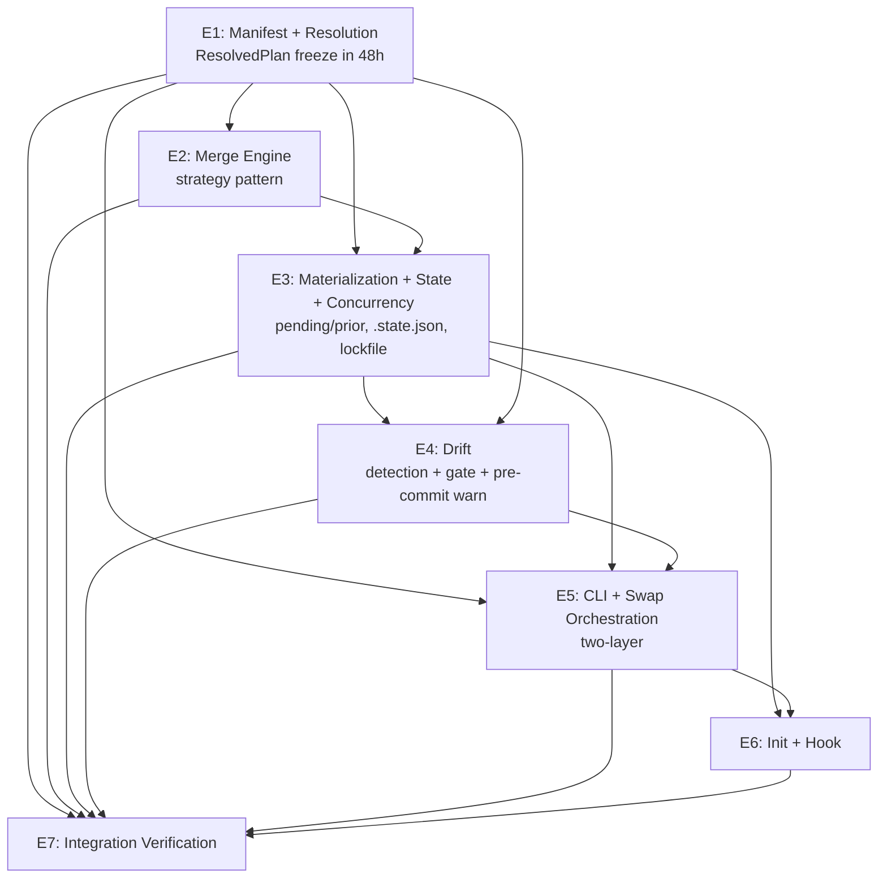

# claude-code-profiles — Decomposition (Phase 3)

**Date**: 2026-04-25
**Companion**: `claude-code-profiles.md` (system spec), `claude-code-profiles-advisory-brief.md`

This document records the Phase 3 decomposition convoy's findings and the synthesis that produced the final epic structure. It is durable for Phase 4 bead authoring and for future re-decomposition triggers (§11 of the spec).

## Summary

The 6-subagent convoy (bounded-context mapper, dependency analyst, scope sizer, interface designer, STPA control structure analyst, structural-semantic gap analyst) converged on **6 developer-owned epics + 1 integration-verification gate**:

1. **E1: Manifest + Resolution** — critical path; `ResolvedPlan` is the system's load-bearing contract
2. **E2: Merge Engine** — strategy pattern; pure transformation
3. **E3: Materialization + State + Concurrency** — pending/prior rename, `.state.json` schema, lockfile primitive
4. **E4: Drift** — detection, gate UX (discard/persist/abort), pre-commit warning
5. **E5: CLI Surface + Swap Orchestration** — two-layer (IO over service)
6. **E6: Init + Hook** — bootstrap-time integration glue
7. **E7: Integration Verification** — cross-epic acceptance gate

Three small spec patches (R14a, R22b, R23a) were applied post-convoy to close residual STPA-identified hazards.

## Convoy convergence (all 6 agents agreed)

- Epic 1 (Manifest + Resolution) is the critical path; `ResolvedPlan` schema must be locked in the first 48h of implementation (advisory P1-7 → confirmed by all agents).
- Merge engine isolates cleanly as a strategy-pattern epic (advisory P2-3 → confirmed).
- Init + Hook + `.gitignore` management form a coherent bootstrap epic (structural ≡ semantic).
- `StateFile` schema must include `schemaVersion` from day one (interface designer + STPA agree).
- Lock primitive is acquired by every mutating verb; it must be a single shared module.

## Convoy disagreements (and how they were resolved)

### D1 — Should Drift split from Materialization+State?

- **§9 spec preview & bounded-context mapper**: keep together (3 = M+S+D, structural cohesion via shared `.state.json` + fingerprint)
- **Scope sizer**: NEEDS_SPLIT — 9 concepts, 3–4 cycles
- **Structural-semantic gap analyst**: split Drift out as its own epic — Drift is a real domain noun (detection + report + gate + pre-commit warning); it's the most user-visible iteration surface per §7

**Resolution**: Split Drift out (E4). Reasons:
- Sizer's overflow concern is real
- Drift has a coherent ubiquitous language (detection, gate, persist, discard, pre-commit warn) that doesn't speak materialization's vocabulary
- §7 quality bar puts drift UX on the highest-iteration path; isolating it shields E3 from cosmetic churn

### D2 — Should Concurrency be its own epic?

- **Mapper**: keep separate (E5/6)
- **Sizer**: fold into CLI orchestration (only 4 concepts, ~1 cycle — too small to stand alone)
- **Gap analyst**: structural cohesion is real but no domain noun — fold into M+S

**Resolution**: Fold Concurrency into E3 (Materialization + State + Concurrency). Reasons:
- Lock acquisition wraps every mutating write the materializer does
- State-schema validation (R42) is already a state-context concern
- Avoids a 1-cycle epic that adds coordination overhead without modular benefit
- Sizer's recommendation aligned with gap analyst's structural read

### D3 — Should Materialization split into 3a (protocol) + 3b (state+drift)?

- **Sizer**: yes (mechanical split to keep cognitive load < 7±2)
- Everyone else: no

**Resolution**: No — the gap analyst's split (D1, Drift out) achieves the same cognitive-load reduction with a more semantic boundary. After folding Concurrency in and splitting Drift out, E3 settles to ~8 concepts, within budget.

## STPA-derived spec patches (applied)

The control-structure analyst identified residual hazards even after the spec already absorbed earlier advisory feedback. Three small patches close meaningful data-loss paths:

- **R14a**: `.state.json` writes must use temp-file + atomic rename. Closes UCA-5.1 (truncated state observable mid-write).
- **R22b**: Persist + materialize is a transactional pair using the same pending/prior pattern. Closes UCA-2.1 (SIGINT mid-persist split-brain where active profile updated but `.claude/` and `.state.json` haven't been refreshed).
- **R23a**: Discard option auto-snapshots `.claude/` to `.claude-profiles/.backup/<ISO>/` (retain 5). Closes UCA-2.3 (discard had no undo because `.claude/` is gitignored). Resurrects advisory P1-8 in a lighter form.

## Final epic structure

### Per-epic detail

#### E1 — Manifest + Resolution

- **Bounded context**: parsing `profile.json`, walking the extends/includes graph, producing `ResolvedPlan`
- **Ubiquitous language**: Manifest, Profile, Component, Extends, Includes, Resolution graph, ResolvedPlan, Provenance, Source, Contributor
- **EARS subset**: R1, R2, R3, R4, R5, R6, R7, R35, R36, R37, R37a
- **In scope**: profile/component discovery; extends walker with cycle detection; includes loader (component name / `./` relative / absolute / `~`); `ResolvedPlan` interface; resolution-time error model (CycleError, MissingProfileError, MissingIncludeError, ConflictError); first-use external-path notice
- **Out of scope**: per-type merge logic (E2); any FS write (E3); CLI parsing (E5)
- **Owner archetype**: enabling
- **Effort**: 2–3 cycles
- **Critical interface produced**: `ResolvedPlan`
- **Key invariants**: `files` lex-sorted by relPath; `chain[chain.length-1] === profileName`; conflict files (R11) never appear in plan — error is thrown
- **Fitness function**: `ResolvedPlan` schema has not changed in ≥ 2 weeks once locked. If it churns, downstream epics are paying the tax.

#### E2 — Merge Engine

- **Bounded context**: per-type byte-content transformation given an ordered contributor list
- **Ubiquitous language**: Strategy, Deep-merge, Concat, Last-wins, Hooks-by-event, Conflict, Contributor
- **EARS subset**: R8, R9, R10, R11, R12
- **In scope**: strategy registry; `settings.json` deep-merge with array-replace default; hooks-by-event override at `hooks.<EventName>` (R12 wins over R8); `*.md` concat in canonical order with worked-example fixture; last-wins fallback; conflict detection
- **Out of scope**: reading/writing files (pure engine); section-marker markdown merging
- **Owner archetype**: complicated-subsystem
- **Effort**: 2–3 cycles
- **Critical interface produced**: `MergedFile { path, bytes, contributors[] }`
- **Key invariants**: pure function of `(orderedContributors, mergeStrategy)`; never reads or writes outside its inputs; R12 wins at `hooks.<EventName>` even when R8 would otherwise replace
- **Fitness function**: hooks-precedence integration test stays green across spec edits

#### E3 — Materialization + State + Concurrency

- **Bounded context**: live `.claude/` tree, `.state.json` truth source, lockfile primitive, signal handlers, atomic-rename protocol
- **Ubiquitous language**: Materialization, Pending, Prior, Backup, Fingerprint, State file, Active profile, Lock, Stale lock, Schema version
- **EARS subset**: R13, R14, R14a, R15, R16, R16a, R17, R22b, R23a, R34, R38, R39, R41, R41a, R41b, R41c, R42, R43
- **In scope**: three-step pending/prior rename (R16) + reconciliation (R16a); `.state.json` schema with `schemaVersion`; atomic state write (R14a); two-tier fingerprint (R18 fast-path metadata); lockfile (R41 series); signal handlers (R41c); discard backup snapshot (R23a); persist transactional pair (R22b); cross-platform copy (R39); 1000-file/2s perf budget (R38); `.gitignore` management for `.claude/`, `.state.json`, `.backup/`
- **Out of scope**: choosing between discard/persist/abort (E4); resolving the plan or merging (E1, E2); CLI parsing (E5)
- **Owner archetype**: platform
- **Effort**: 3–4 cycles (cross-platform rename and crash injection dominate cost)
- **Critical interfaces produced**: `StateFile`, `LockHandle`, atomic-rename protocol, fingerprint format
- **Key invariants**: lockfile bracket the rename pair AND the state-write — partial-success windows unacceptable; reads bypass the lock (R43); reconciliation on startup runs *under* the lock; `schemaVersion` always written
- **Fitness function**: crash-injection test suite stays green across all three OSes after random-kill at any of {pre-pending, post-pending pre-rename-b, post-rename-b pre-rename-c, post-rename-c pre-state-write, post-state-write}
- **Senior-engineer flag**: the cross-platform atomic-rename layer needs a throwaway prototype before the design is committed

#### E4 — Drift

- **Bounded context**: divergence between intended (resolved) and live (`.claude/`) — detection, reporting, the gate UX, persist write-back, and pre-commit warning
- **Ubiquitous language**: Drift, DriftEntry, Modified/Added/Deleted, Provenance, Discard, Persist, Abort, Gate, Pre-commit warn
- **EARS subset**: R18, R19, R20, R21, R22, R22a, R23, R24, R25, R25a
- **In scope**: drift detector consuming the fingerprint primitive from E3; `DriftReport` with provenance; the three-way gate state machine; persist whole-tree write-back (uses E3's pending/prior protocol per R22b); discard path (uses E3's backup per R23a); pre-commit hook drift entry point (`drift --pre-commit-warn`, fail-open)
- **Out of scope**: detection internals (E3 owns fingerprint); CLI argv parsing (E5); hook *installation* (E6)
- **Owner archetype**: stream-aligned (most user-visible iteration surface)
- **Effort**: 2–3 cycles
- **Critical interface produced**: `DriftReport`, gate state machine
- **Key invariants**: gate is hard-blocking and accepts no implicit default in non-interactive sessions (auto-abort or require `--on-drift=`); drift detection is read-only and lock-free; pre-commit path always exits 0
- **Fitness function**: end-to-end gate scenarios (S3, S4, S6) stay green; pre-commit fail-open scenario (S18) stays green; persist split-brain scenario (S15-extension) stays green

#### E5 — CLI Surface + Swap Orchestration

- **Bounded context**: argv parsing, command dispatch, output formatting, exit codes, application-service orchestration that wires E1–E4 together
- **Ubiquitous language**: Command, Verb, JSON mode, Active marker, Status, Diff, Validate, Sync, Exit code
- **EARS subset**: R29, R30, R31, R32, R33, R34, R40
- **In scope (two layers internally)**:
  - **IO layer**: argv parser; `--json` formatter; human-readable output formatters; error-UX standard (always name file/profile/path)
  - **Service layer**: swap orchestrator that calls E1 (resolve) → E4 (drift) → E4 (gate) → E3 (materialize); `validate` calls E1+E2 in dry-run; `sync` re-materializes
- **Out of scope**: hook script content + git installation (E6); init flow (E6); concurrency primitive (E3)
- **Owner archetype**: stream-aligned
- **Effort**: 2.5–3.5 cycles
- **Critical interfaces produced**: command dispatcher, output formatters, exit-code policy
- **Key invariants**: `--json` mode silences all human-readable output; SIGINT flows to lock release; non-TTY swap requires `--on-drift=` flag (no infinite block)
- **Fitness function**: `--json` outputs round-trip-parse cleanly across all read commands; non-TTY swap never blocks

#### E6 — Init + Hook

- **Bounded context**: first-touch and edge-of-system integration — `init`, `.gitignore` management, verbatim pre-commit hook script
- **Ubiquitous language**: Init, Seed profile, Starter, Pre-commit hook, Fail-open, Bootstrap
- **EARS subset**: R26, R27, R28, R25a (script content)
- **In scope**: `init` flow; optional starter-profile seed from existing `.claude/`; `.gitignore` writer for `.claude/`, `.state.json`, `.backup/`; `hook install`/`uninstall` writing the verbatim R25a script; fail-open semantics
- **Out of scope**: materialization mechanics (E3); resolution (E1)
- **Owner archetype**: stream-aligned
- **Effort**: 1–2 cycles
- **Critical interface produced**: bootstrap flow, hook installer
- **Key invariants**: hook script content is verbatim and never edited at install time; `command -v claude-profiles || exit 0` guard always present; init never overwrites existing `.claude-profiles/` without explicit confirmation
- **Fitness function**: hook script byte-identical to R25a across releases unless explicitly bumped

#### E7 — Integration Verification

- **Scope level**: **MEDIUM** (per architect IV-2 contract classification)
- **Justification**: behavioral contracts (DriftReport, gate state machine, command dispatch) cross multiple epics. Composition contracts (lock + rename + state-write ordering) require failure injection. No purely data-only contracts.
- **Contracts under test**:

| Contract | Source | Target | Type | Test approach |
|---|---|---|---|---|
| `ResolvedPlan` | E1 | E2, E3, E4, E5 | behavioral | round-trip + provenance integrity |
| `MergedFile[]` | E2 | E3 | behavioral | per-type merge fixtures incl. R12 vs R8 precedence |
| `StateFile` | E3 | E3 (read), E4, E5 | composition | schema validation + crash injection at every write boundary |
| `LockHandle` | E3 | E3, E4 (persist), E6 (init) | composition | concurrent invocation + signal injection |
| Pending/prior protocol | E3 | reconciliation on next startup | composition | random-kill at every step on macOS/Linux/Windows |
| `DriftReport` | E4 | E5 (display) | behavioral | scenario coverage S2–S6 + S10 |
| Gate state machine | E4 | E5 (orchestration) | composition | discard/persist/abort × interactive/non-interactive |
| Hook script | E6 | git pre-commit | data-only | byte equality + `command -v` guard verified by chaos test (binary removed) |
| CLI command dispatch | E5 | all | behavioral | exit-code matrix; --json round-trip |

- **Dependencies**: E1, E2, E3, E4, E5, E6 — IV runs last
- **Effort**: 1–1.5 cycles

## Critical path & processing order

| Order | Epic | Why this slot |
|---|---|---|
| 1 | E1 (Manifest + Resolution) | `ResolvedPlan` blocks everything else. Lock the type in 48h. |
| 2 (parallel) | E2 (Merge Engine) | Pure; needs only E1 |
| 2 (parallel) | E3 (Materialization + State + Concurrency) | Largest; needs E1 + E2 stub. Begin against typed mocks of MergedFile while E2 finalizes. |
| 3 (parallel) | E4 (Drift) | Needs E1 + E3's fingerprint |
| 3 (parallel) | E6 (Init + Hook) | Needs E3 (state seeding) and E5 stub |
| 4 | E5 (CLI + Swap Orchestration) | Composes E1–E4; ships last |
| 5 | E7 (Integration Verification) | Acceptance gate |

Max realistic parallelism: 2-wide after E1 lands.

**Critical-path interfaces to lock early** (in priority order):
1. `ResolvedPlan` (E1) — day 1–2 of implementation
2. `StateFile` schema with `schemaVersion` (E3) — early E3
3. `LockHandle` + reconciliation contract (E3) — early E3
4. `DriftReport` (E4) — early E4 alongside E5 scaffold

## Multi-criteria validation

- ✅ **Structural**: low change coupling (`StateFile` co-owned by E3+E4 only via narrow port); acyclic dependencies
- ✅ **Semantic**: each epic owns a coherent domain noun
- ✅ **Organizational**: single-owner viable per epic; cognitive load 5–8 concepts each (within 7±2 budget)
- ✅ **Economic**: 6 dev epics — coordination overhead within budget
- ⚠️ **Production-grade slice**: no early "user can swap a real profile" demo until E1+E3+E4+E5 land. Acceptable for a CLI; consider a thin spike that exercises just E1 + E3 (no merge, no drift gate) as an early integration milestone.

## Cognitive load per epic

| Epic | Concept count | Concepts |
|---|---|---|
| E1 | 8 | profile.json schema, manifest validator, extends walker, includes loader, path classification, ResolvedPlan, DAG ordering, external-trust notice |
| E2 | 5 | strategy dispatcher, deep-merge, concat, last-wins, hooks-by-event-with-precedence |
| E3 | 8 | pending/prior, rename protocol, reconciliation, .state.json schema, fingerprint two-tier, lockfile, signal handlers, copy strategy |
| E4 | 6 | DriftReport, status-enum, provenance, three-way gate, persist write-back, pre-commit warn |
| E5 | 8 | argv parser, dispatcher, JSON formatter, human formatter, swap orchestration sequence, validate orchestration, sync, exit codes |
| E6 | 5 | init flow, starter seed, .gitignore writer, hook installer, fail-open |

All within 7±2.

## Risks & re-decomposition triggers

Per spec §11:

- **High coupling risk**: E3 ↔ E4 share `DriftReport` and `StateFile` semantics. Lock these contracts before parallel work; expect 1–2 churn rounds; budget for them.
- **Senior-engineer dependence**: E3's atomic-rename layer dominates cost. Prototype on macOS + Linux + Windows before committing.
- **Re-decomposition triggers**: if the `ResolvedPlan` schema churns 2× in a quarter, or if E3 requires bypass logic that crosses ≥ 3 epics, or if `~/.claude/` management is added in v2 (likely a new bounded context), re-open the decomposition.

## Convoy report attribution

Each subagent contributed approximately equal weight to this synthesis:

- **Bounded context mapper**: proposed the 6-epic shape with Concurrency as separate; flagged DriftReport / StateFile coupling
- **Dependency analyst**: produced the dependency graph, processing order, and parallelization waves
- **Scope sizer**: flagged Materialization+State+Drift as NEEDS_SPLIT; proposed the 3a/3b mechanical split (rejected in favor of D1's semantic split)
- **Interface designer**: produced the 6 critical interface contracts (`ResolvedPlan`, `DriftReport`, `StateFile`, `LockHandle`, pending/prior protocol, CLI dispatch); flagged TOCTOU on external paths
- **STPA control structure analyst**: identified the 7 hazards (H1–H7), 9 unsafe control actions, and the 3 spec patches (R14a, R22b, R23a)
- **Structural-semantic gap analyst**: identified the 5 partition disagreements; recommended Drift split + Concurrency fold (the structure adopted)

The full per-agent reports are preserved in the conversation history of the architect session.
