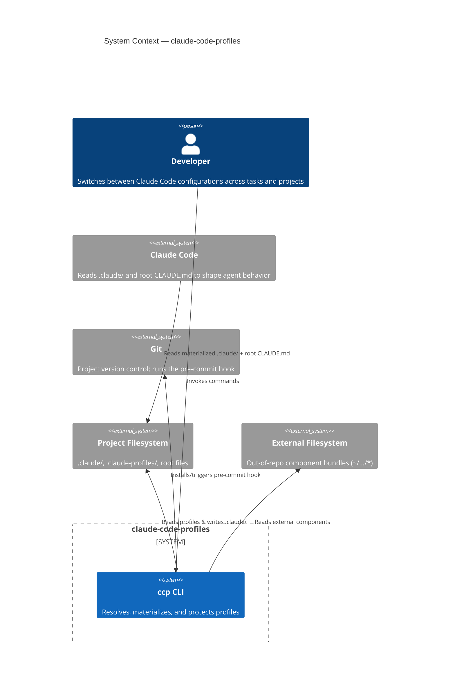
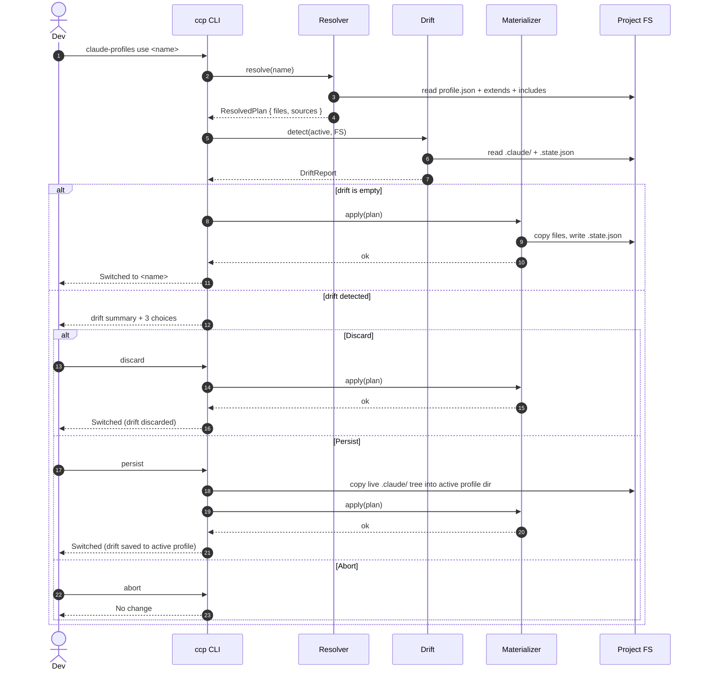

# claude-code-profiles — System Specification

**Status**: Draft (Phase 2 of architect skill, revised post-advisory)
**Date**: 2026-04-25
**Owner**: Ryan Henderson
**Revisions**: Initial draft → applied consensus advisory fixes (P0-1 through P0-4 + selected P1s). See `claude-code-profiles-advisory-brief.md` for the full advisory record.

## 1. Problem & Vision

Claude Code's behavior in a project is shaped by a tree of files: `.claude/` (commands, agents, skills, hooks, settings, plugin manifest), the root `CLAUDE.md`, and assorted home-level config. Users frequently want multiple *configurations* per project — a "minimal" mode for quick fixes, a "compound-agent" mode with full ceremony, a "client-X" mode with sanitized tooling, a "security-review" mode with focus tightened. Today, switching means hand-editing files or git-stashing config changes against project code. Both are error-prone and lossy.

`claude-code-profiles` is a TypeScript CLI (npm-published) that turns a project's Claude Code configuration into a swappable artifact. Each named profile is a folder under `.claude-profiles/`. Profiles compose via single-parent inheritance plus additive component bundles. Switching profiles is a single command that deterministically materializes `.claude/` from sources, with a strict drift gate that protects scratch edits.

## 2. Glossary (Ubiquitous Language)

| Term | Definition |
|---|---|
| **Profile** | A named, complete-or-near-complete configuration. A folder at `.claude-profiles/<name>/` containing a `.claude/` subdir and a `profile.json` manifest. |
| **Component** | A reusable, partial bundle of `.claude/` content. Lives at `.claude-profiles/_components/<name>/` (in-repo) or at any absolute / `~`-relative filesystem path (out-of-repo). |
| **Manifest** | `profile.json` — the per-profile config file declaring metadata, `extends`, and `includes`. |
| **Extends** | Linear, single-parent inheritance: `profile.extends = "<name>"`. Override semantics. |
| **Includes** | Additive list of component bundles applied on top of the inheritance chain. Conflict-detected. |
| **Active profile** | The profile currently materialized into `.claude/`. Identified in `.claude-profiles/.state.json`. |
| **Materialization** | The deterministic process of resolving the inheritance + includes graph into final files in `.claude/` via copy. |
| **Drift** | Any divergence between the live `.claude/` tree and the fingerprint stored at the time of last materialization. |
| **Resolution graph** | The DAG of `extends` chain + `includes` list that produces a final flat file list with provenance. |
| **State file** | `.claude-profiles/.state.json` — tracks active profile, materialized fingerprint, and resolved sources. |

## 3. System-Level EARS Requirements

### 3.1 Discovery & Resolution
- **R1 (U)**: The system shall enumerate profiles by scanning top-level directories of `.claude-profiles/` (excluding entries beginning with `_` or `.`).
- **R2 (U)**: The system shall identify a profile by its directory name; the directory name is the profile's canonical identifier.
- **R3 (E)**: When resolving a profile, the system shall follow `extends` references upward to construct a linear inheritance chain.
- **R4 (UN)**: If the inheritance chain contains a cycle, the system shall abort with an error naming the cycle's members.
- **R5 (UN)**: If `extends` references a non-existent profile, the system shall abort with an error naming the missing profile.
- **R6 (E)**: When resolving `includes`, the system shall load each referenced component and apply them additively after the inheritance chain.
- **R7 (UN)**: If `includes` references a path that does not exist on disk (in-repo or external), the system shall abort with an error naming the missing path.

### 3.2 Merge & Conflict
- **R8 (E)**: When merging files of type `settings.json`, the system shall deep-merge objects; arrays at the same path shall be replaced by the later source.
- **R9 (E)**: When merging files of type `*.md` (notably `CLAUDE.md` inside `.claude/`), the system shall concatenate content in resolution order: oldest ancestor first, then descendants down the extends chain, then includes in declaration order, then the profile itself last. Worked example: for chain `base ← extended ← profile` with `profile.includes = ["compA", "compB"]`, the concat order is `base, extended, compA, compB, profile`.
- **R10 (U)**: For all other file paths inside `.claude/`, the system shall apply file-level last-wins semantics keyed by relative path.
- **R11 (UN)**: If two `includes` (or an include and an extends ancestor) define the same non-mergeable file path, the system shall abort with a conflict error naming the path and contributors. The profile itself may always override by providing its own copy of the file.
- **R12 (UN)**: Hooks in `settings.json` follow the shape `{ "hooks": { "<EventName>": [<actions>] } }`. The system shall merge hooks by event name, concatenating action arrays in resolution order. R12 takes precedence over R8's array-replace rule at the `hooks.<EventName>` path.

### 3.3 Materialization & State
- **R13 (E)**: When the user runs `claude-profiles use <name>`, the system shall, after passing the drift gate, materialize the resolved file list into `.claude/` by copying.
- **R14 (E)**: When materialization completes, the system shall write `.claude-profiles/.state.json` containing `{ schemaVersion, activeProfile, materializedAt, resolvedSources[], fingerprint, externalTrustNotices[] }`.
- **R14a (U)**: Writes to `.state.json` shall use a temp-file + atomic rename pattern: write to `.state.json.tmp`, fsync, rename to `.state.json`. Truncated or torn writes shall not be observable by readers.
- **R15 (U)**: The system shall ensure `.claude/` and `.claude-profiles/.state.json` are listed in the project's `.gitignore` after `claude-profiles init`.
- **R16 (U)**: The system shall materialize via a three-step rename protocol: (a) write the resolved file tree to `.claude-profiles/.pending/`, (b) atomically rename the existing `.claude/` to `.claude-profiles/.prior/` (if present), (c) atomically rename `.pending/` to `.claude/`. On any failure during (a), the pending directory is removed. On any failure during (b)–(c), the prior directory is renamed back to `.claude/`. On success, `.prior/` is removed in the background.
- **R16a (UN)**: If `.pending/` or `.prior/` exists at startup (indicating a prior crashed materialization), the system shall reconcile state: prefer `.prior/` if present (restore), otherwise discard `.pending/`. The user is informed.
- **R17 (U)**: The system shall not modify any path outside the project root, including `~/.claude/`.

### 3.4 Drift Detection & Persistence
- **R18 (U)**: The system shall compute drift by comparing the live `.claude/` tree against the fingerprint and resolved sources recorded in `.state.json`. Drift detection uses a two-tier check: a fast path comparing file mtime + size against recorded values, and a slow path that recomputes content hashes only for files whose metadata indicates a possible change.
- **R19 (U)**: Drift includes: modified files, added files, and deleted files anywhere within `.claude/`.
- **R20 (E)**: When the user runs `claude-profiles drift`, the system shall print a per-file report showing path, status (modified/added/deleted), and source provenance for the current materialization.
- **R21 (E)**: When the user runs `claude-profiles use <name>` and drift is detected, the system shall hard-block until the user selects one of: **discard**, **persist**, **abort**.
- **R22 (E)**: When the user selects **persist**, the system shall copy the entire current `.claude/` tree (including any added or deleted files relative to the resolved sources) into the active profile's directory, overwriting that profile's existing files. Component and extends-ancestor sources are not modified. Per-file write-back routing is deferred to v2.
- **R22a (U)**: After persist, the active profile's `.claude/` content reflects the live state at the moment of persist. The user may afterward manually propagate changes from the active profile back to a component or parent profile if desired.
- **R22b (U)**: Persist + materialize is a transactional pair. The system shall perform persist using the same pending/prior pattern as R16: write the new profile contents to `.claude-profiles/<active>/.pending/`, atomically rename `<active>/.claude/` to `<active>/.prior/`, atomically rename `.pending/` to `.claude/`. If the process is killed between persist completion and subsequent materialization, the next CLI invocation reconciles: persist's `.prior/` rolls back if `.state.json` was not yet updated; persist sticks if it was. The user is informed of any reconciliation taken.
- **R23 (E)**: When the user selects **discard**, the system shall proceed with materialization, overwriting drifted content.
- **R23a (U)**: Before destroying drifted content via discard, the system shall snapshot the live `.claude/` tree to `.claude-profiles/.backup/<ISO-8601 timestamp>/`. The system shall retain at most 5 backup snapshots, pruning oldest first. Backups are not advertised in the CLI surface beyond a one-line "(snapshot saved to ...)" notice; users can restore manually if needed. The `.backup/` directory shall be gitignored.
- **R24 (E)**: When the user selects **abort**, the system shall make no changes.
- **R25 (O)**: Where the user has installed the git pre-commit hook, the system shall warn (non-blocking) on commit if `.claude/` contains drift relative to the active profile.
- **R25a (U)**: The pre-commit hook script content is fixed and minimal:
  ```sh
  #!/bin/sh
  command -v claude-profiles >/dev/null 2>&1 || exit 0
  claude-profiles drift --pre-commit-warn 2>&1
  exit 0
  ```
  The hook is fail-open: missing or broken `claude-profiles` binary never blocks commits. Drift is reported but never exits non-zero from the hook path.

### 3.5 Initialization & Migration
- **R26 (E)**: When the user runs `claude-profiles init` in a project with no `.claude-profiles/` folder, the system shall create the folder and offer to seed a starter profile from the existing `.claude/` (if present).
- **R27 (E)**: When seeding from existing `.claude/`, the system shall copy the contents into `.claude-profiles/<chosen-name>/.claude/` and write a minimal `profile.json`.
- **R28 (U)**: After init, the system shall add `.claude/` and `.claude-profiles/.state.json` to `.gitignore` (creating the file if absent), and shall offer to install the pre-commit hook.

### 3.6 CLI Surface (Public Verbs)
- **R29 (U)**: The system shall expose the following commands: `init`, `list`, `use <name>`, `status`, `drift`, `diff <a> [<b>]`, `new <name>`, `validate [<name>]`, `sync`, `hook install|uninstall`.
- **R30 (E)**: When the user runs `claude-profiles list`, the system shall print all profiles with active marker, extends parent, includes list, and last-materialized timestamp.
- **R31 (E)**: When the user runs `claude-profiles status`, the system shall print active profile, drift summary, and any unresolved warnings.
- **R32 (E)**: When the user runs `claude-profiles diff <a> [<b>]`, the system shall show the file-level differences between the resolved file lists of `<a>` and `<b>` (or `<a>` and the active profile).
- **R33 (E)**: When the user runs `claude-profiles validate`, the system shall verify all profiles and components: parse manifests, resolve graphs, detect conflicts, check external paths exist, and print a pass/fail report.
- **R34 (E)**: When the user runs `claude-profiles sync`, the system shall re-materialize the active profile (after passing the drift gate) without changing which profile is active.

### 3.7 Manifest Schema
- **R35 (U)**: The system shall accept the following `profile.json` fields: `name` (string, optional, defaults to dir name), `description` (string, optional), `extends` (string, optional), `includes` (array of strings, optional), `tags` (array of strings, optional).
- **R36 (UN)**: If `profile.json` is missing required fields or contains unknown fields, the system shall print a validation warning naming the field but shall not abort unless the file is unparseable.
- **R37 (U)**: An `includes` entry shall be one of: a bare component name (resolved against `.claude-profiles/_components/<name>/`), a relative path beginning with `./`, or an absolute / `~`-relative filesystem path.
- **R37a (U)**: External component paths (anything outside the project root) are treated as fully user-trusted. The system performs no integrity verification, signature check, or sandboxing of their contents. Users are responsible for vetting what those paths point to. The CLI shall print a one-time "external path trusted" notice the first time a profile that uses such a path is materialized in a project, recorded in `.state.json` so the notice is not repeated.

### 3.8 Concurrency & State Integrity
- **R41 (U)**: Before any write operation (`use`, `sync`, persist write-back, init, hook install), the system shall acquire an exclusive lock at `.claude-profiles/.lock`. The lock file contents shall be `<PID> <ISO-8601 timestamp>`.
- **R41a (UN)**: If the lock file exists with a live PID, the system shall abort with a message naming the holding PID and timestamp.
- **R41b (E)**: If the lock file exists but the recorded PID is not running (stale lock), the system shall remove and re-acquire it. Stale-detection is by `kill -0 <pid>` (or platform equivalent).
- **R41c (U)**: The lock shall be released on normal exit, on caught termination signals, and via a process-exit handler.
- **R42 (U)**: On every read of `.state.json`, the system shall validate the file against a schema. An unparseable, missing, or schema-invalid state file shall be treated as `NoActive` (the same state as a fresh project) with a non-fatal warning. The system shall not abort.
- **R43 (U)**: Read operations (`list`, `status`, `drift`, `diff`) shall not require the lock; they may produce slightly stale views during concurrent writes. Only mutating operations are serialized.

### 3.9 Quality & Performance
- **R38 (U)**: The system shall complete a `use` operation against a profile of up to 1000 files in under 2 seconds on a developer laptop.
- **R39 (U)**: The system shall support Node.js LTS (≥ 20) on macOS, Linux, and Windows. On Windows, only the copy strategy is supported (no symlink modes are exposed).
- **R40 (U)**: The system shall produce human-readable output by default and machine-readable output (`--json`) for the `list`, `status`, `drift`, and `diff` commands.

## 4. Architecture

### 4.1 C4 Context



### 4.2 Swap Sequence (with drift gate)



### 4.3 Active Profile State

```mermaid
stateDiagram-v2
    [*] --> Uninitialized: project has no .claude-profiles/
    Uninitialized --> Initialized: claude-profiles init
    Initialized --> NoActive: state.json absent
    NoActive --> Clean: use <name> succeeds
    Clean --> Drifted: user edits .claude/
    Drifted --> Clean: sync (discard) | drift→persist
    Clean --> Clean: use <other> (no drift)
    Drifted --> Drifted: use <other> blocked at gate
    Drifted --> Clean: use <other> + discard|persist
    Clean --> NoActive: rare; state.json deleted
```



## 5. Scenario Table (selected)

| ID | Scenario | EARS refs | Trigger | Expected outcome |
|---|---|---|---|---|
| S1 | First-time init in project with existing `.claude/` | R26, R27, R28 | `claude-profiles init` | Folder created, starter profile seeded, gitignore updated |
| S2 | Clean swap (no drift) | R13, R14 | `use <name>` | `.claude/` replaced; `.state.json` updated |
| S3 | Drift gate — discard | R21, R23 | `use <other>` after edits | Edits lost; new profile materialized |
| S4 | Drift gate — persist | R21, R22, R22a | `use <other>` after edits | Whole live `.claude/` tree copied into active profile; then swap proceeds |
| S5 | Drift gate — persist with component drift | R22, R22a | `use <other>` after editing a component-sourced file | File saved to active profile (overrides component); component left untouched. User informed they can promote later if desired. |
| S6 | Drift gate — abort | R24 | `use <other>` | No change to disk |
| S7 | Include conflict | R11 | `use <name>` whose includes overlap | Error naming both contributors and the path |
| S8 | Missing external component | R7 | `use <name>` with broken external include | Error naming the missing path |
| S9 | Cycle in extends | R4 | `use <name>` in a cyclic chain | Error naming cycle members |
| S10 | Pre-commit warning | R25 | `git commit` with drift present | Hook prints warning, commit proceeds |
| S11 | Validate all profiles | R33 | `validate` | Pass/fail report; non-zero exit on failures |
| S12 | Sync after editing the active profile directly | R34 | `sync` | Re-materializes; drift gate runs first |
| S13 | Diff two profiles | R32 | `diff a b` | File-level diff of resolved file lists |
| S14 | Concurrent `use` invocations | R41, R41a | Two terminals run `use` simultaneously | Second invocation aborts cleanly with PID/timestamp message |
| S15 | Stale lock recovery | R41b | `use` after a prior process crashed mid-write | Lock auto-released; operation proceeds |
| S16 | Crash mid-materialization | R16, R16a | Process killed during step (b)/(c) | Next CLI invocation reconciles via `.prior/` rename-back |
| S17 | Corrupted .state.json | R42 | `status` with malformed state file | Treated as `NoActive`; warning printed; no abort |
| S18 | Pre-commit hook with missing binary | R25a | `git commit` after `claude-profiles` removed | Hook exits 0 silently; commit proceeds |

## 6. Out of Scope (v1)

- Mutation of `~/.claude/` (plugins, MCP, settings) — explicitly deferred. Profiles describe project-level config only.
- Pre/post lifecycle hooks on swap.
- Symlink materialization (Windows compatibility cost not justified for v1).
- Section-marker-based merging within markdown files (concat is sufficient).
- npm-published or git-URL components (in-repo and filesystem paths only).
- B2-style derived root `CLAUDE.md` (root file is left untouched; profile additions go in `.claude/CLAUDE.md`).
- Per-worktree profile state — profiles work per-project root; multiple worktrees of the same repo share `.claude-profiles/` via git but have independent `.claude/` and `.state.json` (acceptable; not actively designed for).

## 6.5 Alternatives Considered

### GNU Stow + thin shell wrapper
Stow can manage profile-as-symlink-farm trivially: `stow -d .claude-profiles -t .claude <name>` creates symlinks from `.claude/` into the chosen profile dir. Drift detection becomes "any symlink replaced by a real file" — also trivial. A ~50-line shell wrapper would cover state tracking and `.gitignore` management.

**Why we chose a TypeScript CLI instead**:
1. **Windows support (R39)**: Stow is symlink-based; symlink semantics on Windows are unreliable for non-admin users and break editor tooling.
2. **Per-type merge (R8, R9, R12)**: Stow does not merge — it links one source per path. `settings.json` deep-merge and `CLAUDE.md` concatenation cannot be expressed in a symlink farm.
3. **Drift gate UX (R21–R24)**: The interactive discard/persist/abort gate, the per-file driftrep ort with provenance, and the persist write-back flow all require a real program.
4. **`.state.json` and structured output (R40)**: JSON output for `list`/`status`/`drift`/`diff` is awkward to produce from shell.

If the merge engine is ever dropped from v1 (a P1 advisory suggestion not taken), stow becomes a viable thinner alternative worth re-evaluating.

### Symlink farm built into the tool
Considered and rejected for the same Windows-compatibility reason as stow. Copy-on-swap is the deliberate choice; the drift workflow is designed around it.

### Per-file persist-back routing (rejected)
The original design (pre-advisory) had per-drifted-file write-back to active profile, extends ancestor, or originating component. Advisors converged on this being disproportionate complexity (estimated ~40% of dev time, surprising UX, large edge-case surface, silent multi-profile side effects when writing to shared components). v1 collapses persist to whole-tree write-back to the active profile only (R22). Component-level routing may return in v2 once usage data shows demand.

## 7. Quality Bar

This is a CLI, not a UI product, so `/compound:build-great-things` does not apply at full strength. However, the user-facing surface area that matters is:

- **Drift output**: must be skimmable, clear about source provenance, and copy-pasteable for diff inspection.
- **Pre-swap gate**: must communicate exactly what's at stake before the user picks discard/persist/abort. No surprise data loss.
- **Status / list**: must answer "what's active, what exists, what's drifted" in a single screenful.
- **Errors**: must always name the file/profile/path involved. No generic "resolution failed."

Charm-style polished CLI UX is the implicit reference; aim for output that holds up in a screencast.

## 8. Default Delivery Profile (advisory)

This system has a clear shape: **`cli`**. Materialized as a TypeScript package published to npm with a single binary entry point. Downstream verification contracts should target: package install, binary invocation, exit codes, stdout/stderr formatting, and cross-platform file operations. Plan-phase verification should not assume a webapp-style preview surface.

## 9. Bounded Context Preview (informs Phase 3 decomposition)

Candidate epics — final shape decided by the 6-subagent decomposition convoy. Post-advisory consolidation has reduced this from 11 candidates to ~7. Several previously separate domains (persistence-flow, separate state-from-materialization) collapse cleanly:

1. **Manifest + Resolution** — `profile.json` parsing, schema, validation; extends chain, includes graph, cycle detection, provenance tracking. The `ResolvedPlan` interface produced here is the critical-path contract — must be locked first in implementation.
2. **Merge engine** — per-type merge rules (deep-merge, concat, last-wins, hooks-by-event). Internally structured as a strategy pattern with isolated per-type handlers so each type can be reasoned about independently.
3. **Materialization + State + Drift** — three-step pending/prior rename protocol; `.state.json` schema; fingerprint with two-tier check (mtime+size fast path, content-hash slow path); diff representation and provenance reporting.
4. **CLI surface + Swap orchestration** — command parsing, drift gate orchestration (the discard/persist/abort flow), plan→apply, rollback, error UX, human + JSON output formatting.
5. **Git hook + Init / migration** — pre-commit installer with the verbatim script (R25a), bootstrap flow (`init`), `.gitignore` management.
6. **Concurrency & integrity** — lockfile acquisition/release/stale handling, state schema validation, signal handlers. Cross-cuts items 3 and 4 but small enough to potentially fold into 4.
7. **Integration verification** — cross-epic contract validation (per architect protocol).

The 6-subagent decomposition convoy may rebalance these (e.g., split orchestration from CLI surface, or fold concurrency into materialization). The key constraints from advisory feedback:
- Items 1's `ResolvedPlan` schema is the critical path.
- Items 3 and 4 cannot be developed against floating contracts — locks/state/drift formats are shared invariants.
- Cognitive load per epic stays in the 7±2 concept range (advisory P2).

## 10. Key Assumptions

- Claude Code's runtime concatenation of `<root>/CLAUDE.md` + `<project>/.claude/CLAUDE.md` continues. If this changes upstream, the B1 model needs revisiting.
- Project filesystem supports atomic file rename (true on all supported OSes).
- Users edit `.claude/` rarely *during* a profile session, often *between* profile sessions; the drift gate is for the latter.
- Profiles are typically O(10–100) files; performance budget assumes ≤ 1000.

## 11. Re-decomposition Triggers (fitness functions)

Re-open the architectural decomposition if any of:

- Cross-epic interface contracts churn more than 2× in a quarter.
- Drift gate UX requires bypass logic that crosses ≥ 3 epics.
- Home-level (`~/.claude/`) management is added in v2 — likely needs new epic and new bounded context.
- Symlink materialization is added — affects materialization, drift, and state contexts simultaneously.

---

*Phase 2 spec complete. Phase 3 will decompose this into epics via the 6-subagent convoy.*
