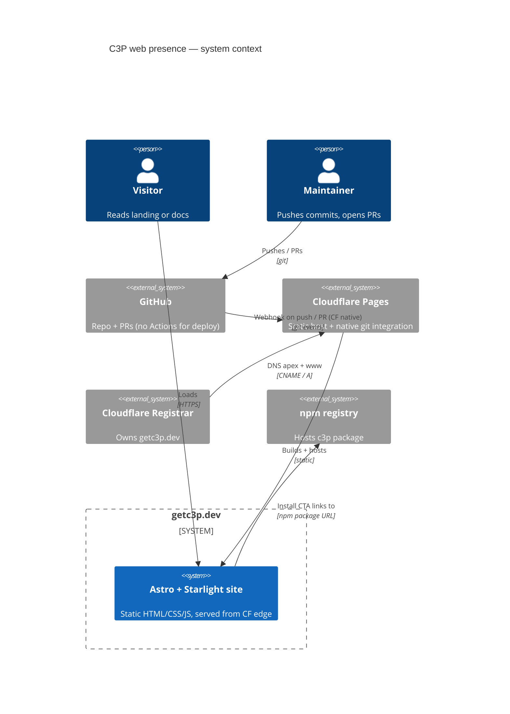
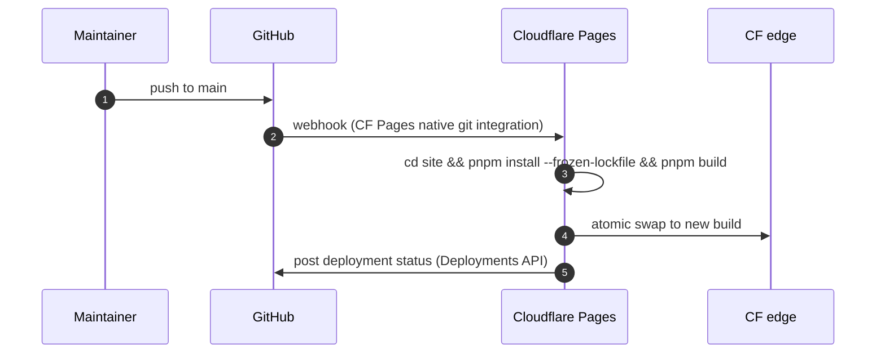
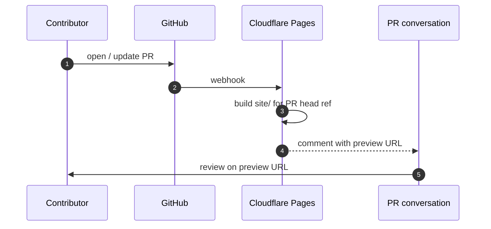
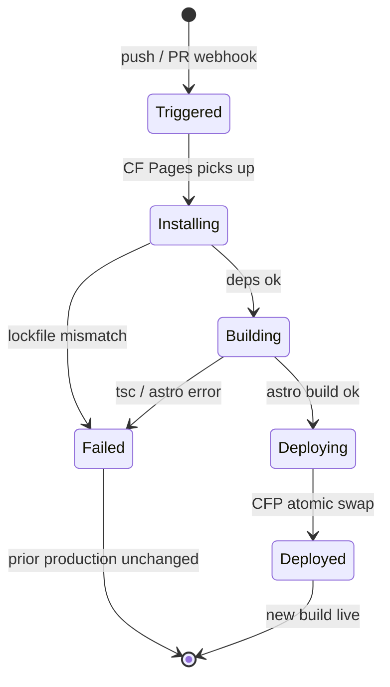

# getc3p.dev — marketing + docs site

**Status**: Approved at Gate 2 (revised post-advisory)
**Domain**: `getc3p.dev` (registered at Cloudflare Registrar)
**Stack**: Astro + Starlight, single app at `site/`, deployed by Cloudflare Pages' native GitHub integration
**Repo layout**: lightweight — CLI stays at repo root, `site/` is a sibling directory; no pnpm workspaces

> **Revision note**: this spec was revised at Gate 2 in response to the advisory
> brief (`getc3p-web-presence-advisory-brief.md`). The original Gate 1 choices —
> "full monorepo restructure" and "custom GitHub Actions deploy workflow" — were
> overruled by the human in favor of the lighter layout and Cloudflare Pages
> native git integration. All three design recommendations were adopted and
> folded into R-U-4 / R-U-7 below.

## Problem statement

C3P (the `claude-code-config-profiles` npm package, binary `c3p`) ships at `0.3.0`
with a substantive README and a recognisable C-3PO-flavoured voice, but no
top-of-funnel landing page that explains *what C3P is* and *why someone would
use it* in under 10 seconds, and no canonical reference URL.

This spec defines a single web property at `getc3p.dev`:

- a **marketing landing** at `/` — a "drift-gate blocks the swap" demo, persona-
  oriented feature cards, install CTA, subtle C-3PO voice
- a **documentation site** under `/docs/*` — concepts, grouped CLI reference,
  guides (with a Migration subsection)

…shipped from a single Astro + Starlight app at `site/`, deployed by
Cloudflare Pages' native GitHub integration on every push to `main`, with
preview deploys on every PR.

## Goals

1. Net-new visitor sees the **drift-gate value prop in motion** within 10
   seconds on `/`
2. Single canonical URL to link to (`getc3p.dev`)
3. Docs site with sidebar navigation, full-text search (Pagefind), dark mode,
   visual diagrams for layered concepts
4. Continuous deployment — every merge to `main` updates production within ~3
   minutes (CF Pages native)
5. Preview deploy URL on every pull request (CF Pages native)
6. The CLI's existing release/publish flow keeps working **untouched** — no
   regressions on `release-please`, npm OIDC trusted publishing, or matrix CI

## Non-goals

- Blog / changelog feed (CHANGELOG.md remains canonical)
- Versioned docs (single "current" version until 1.0)
- i18n (English only)
- Self-hosted analytics (defer; CF Web Analytics later if wanted)
- Custom design system / component library (Starlight defaults + tailored tokens)
- Pricing page / paid tier (none planned)
- **Custom GitHub Actions deploy workflow** (overruled at Gate 2 in favor of CF
  Pages native; no `deploy-site.yml` is created)
- **Monorepo restructure** (overruled at Gate 2; CLI stays at repo root)

## Hard constraints

- **Domain**: `getc3p.dev` registered at Cloudflare Registrar
- **Host**: Cloudflare Pages (free tier)
- **Stack**: Astro + Starlight (single app, *not* two separate apps)
- **CD**: Cloudflare Pages native GitHub integration — auto-deploys on push to
  `main`, posts preview URLs on PRs. **No GitHub Actions deploy workflow.**
  Build command and output dir are configured in the CF Pages dashboard.
- **Repo layout**: existing CLI source tree (`src/`, `tests/`, `package.json`,
  `tsconfig*.json`, `vitest.config.ts`) stays at repo root, untouched. Site
  lives at `site/` as a sibling directory with its own `package.json` and
  lockfile. No pnpm workspace.
- **Voice**: subtle C-3PO flourishes tied to UX moments (drift gate prompt
  framing, doctor output personality, 404 voice) — not stray lines in the
  footer.

## EARS requirements

Numbered for traceability. Pattern abbreviations: **U**=ubiquitous, **E**=event,
**S**=state, **UN**=unwanted, **O**=optional.

### Site shape

- **R-U-1** The system shall serve a single Astro application at `getc3p.dev`
  whose root path renders a marketing landing page.
- **R-U-2** The system shall serve documentation under the URL prefix `/docs/`,
  rendered by Astro's Starlight integration.
- **R-U-3** The system shall expose a Pagefind-powered search index covering all
  pages under `/docs/`.
- **R-S-1** While the user agent indicates a `prefers-color-scheme: dark`
  preference, the site shall render in dark mode by default.
- **R-O-1** Where a `?theme=` query parameter is present, the site may override
  the preferred-color-scheme default. (Starlight default behaviour.)
- **R-U-14** All site bytes shall be statically generated; the deploy artifact
  shall contain no server-rendered routes.

### Marketing landing (revised per design rec A)

- **R-U-4** The marketing landing shall include:
  - **Hero with motion demo**: a "drift-gate blocks the swap" sequence — an
    animated terminal (or high-fidelity SVG) showing `c3p use dev` being
    refused because of an uncommitted edit to `.claude/settings.json`. Lands
    the safety value of the drift gate without requiring the visitor to
    understand the term "drift gate" first.
  - **Headline + subhead**: ≤ 7 words above the demo; one-line subhead naming
    the product.
  - **Primary CTA**: "Install" — copy-on-click `npm install -g claude-code-config-profiles`.
  - **Secondary CTA**: "Read the docs" → `/docs/`.
  - **Persona-shaped feature cards** (3 cards):
    - **The solo dev** — "Experimental vs stable profiles without `git stash` hacks."
    - **The team lead** — "One source of truth for `.claude/`, shared across the team."
    - **The CI/CD engineer** — "Atomic, drift-proof swaps for deterministic agent runs."
  - **Footer** with GitHub + npm + License links and a single C-3PO flourish.
- **R-U-5** The system shall render Open Graph and Twitter Card metadata on
  every page. A single static OG image is the v1 minimum; per-route generation
  is a follow-up if traffic warrants it.
- **R-U-6** The system shall include a custom 404 page in the C-3PO voice
  (e.g. "I appear to have misplaced this page.") with a search box and a link
  back to `/`.

### Docs surfaces (revised per design recs B, C, E)

- **R-U-7** The docs site shall be organised under four top-level sections,
  in this order:
  1. **Concepts** — profile, extends, includes, drift, materialize. Each
     concept is one page.
  2. **CLI Reference** — grouped, not flat:
     - **Core loop**: `init`, `new`, `use`, `status`
     - **Inspection**: `list`, `drift`, `diff`, `validate`
     - **Maintenance**: `sync`, `hook`, `doctor`, `completions`
  3. **Guides** — quickstart, CI usage, profile-managed CLAUDE.md sections,
     and a **Migration** sub-section (sourced from `docs/migration/`).
     Migration is *not* a top-level pillar.
  4. **About** — what C3P is, why it exists, how to contribute, license.
- **R-U-8** Every CLI reference page shall include the verb's `--help` text
  rendered as a code block plus a runnable example.
- **R-E-1** When a docs page contains a code block tagged `bash`, the system
  shall render a copy-on-click button.
- **R-U-16** The Concepts pages for `extends` and `includes` shall include a
  **visual inheritance/composition diagram** (Mermaid) showing how files
  layer or splice. Prose-only descriptions are insufficient.

### Build, deploy, hosting (revised — CF Pages native)

- **R-E-2** When a commit lands on the `main` branch, Cloudflare Pages shall
  produce a production deployment of `site/` within 5 minutes of push, using
  its native GitHub integration. **No GitHub Actions workflow is involved.**
- **R-E-3** When a pull request is opened or updated, Cloudflare Pages shall
  produce a preview deployment of `site/` and surface the preview URL via its
  native GitHub Deployment / PR comment integration within 5 minutes. **No
  custom workflow handles previews.**
- **R-S-2** While a deploy is running, the previous production deployment at
  `getc3p.dev` shall continue serving traffic uninterrupted (CF Pages atomic
  swap, default behaviour).
- **R-UN-1** If the production build step fails, the system shall not promote
  any partial build to `getc3p.dev`; the previous deployment shall remain live
  (CF Pages default behaviour).
- **R-UN-3** The CF Pages build configuration shall use a non-elevated build
  context: `cd site && pnpm install --frozen-lockfile && pnpm build`. No build
  step shall require GitHub Actions secrets, since none are involved.

### Existing pipeline preservation

- **R-U-13** The existing matrix CI (`.github/workflows/ci.yml`) shall remain
  unmodified — it continues to typecheck, build, and test the CLI on
  `linux/macos/windows × node 20/22`.
- **R-U-15** The existing release pipeline (`.github/workflows/release-please.yml`,
  `.release-please-config.json`, `.release-please-manifest.json`) shall remain
  unmodified, including the npm OIDC trusted-publisher entry on npmjs.com which
  keys on this workflow file path.

### Cross-cutting

- **R-U-17** The site shall pass an automated Lighthouse run with Performance,
  Accessibility, Best Practices, and SEO scores ≥ 90 on the landing page and a
  representative docs page.
- **R-O-2** Where the build environment provides a `CF_WEB_ANALYTICS_TOKEN`,
  the site may include the Cloudflare Web Analytics script. (Optional.)

## Architecture diagrams

### C4 context



### Deploy sequence (CF Pages native — production)



### Deploy sequence (CF Pages native — preview / PR)



### Build state lifecycle



## Scenario table

| # | Scenario | Trigger | Expected | Refs |
|---|----------|---------|----------|------|
| 1 | First-time visitor lands | Open getc3p.dev | Drift-gate demo + persona cards visible above fold; LCP < 2.5s | R-U-1, R-U-4, R-U-17 |
| 2 | Read CLI reference | Click `c3p use` from sidebar | Verb page renders --help block + runnable example; copy button on bash blocks | R-U-7, R-U-8, R-E-1 |
| 3 | Search docs for "drift" | Type in search box | Pagefind returns results across docs/ within 200ms perceived | R-U-3 |
| 4 | Push to main | git push origin main | Production deploy live within 5 min via CF Pages native | R-E-2, R-S-2 |
| 5 | Open PR | gh pr create | CF Pages posts preview URL on PR within 5 min | R-E-3 |
| 6 | Build fails | Broken Astro markup pushed | CF Pages reports failure, prod URL still serves last good build | R-UN-1 |
| 7 | Visitor on dark-mode OS | Open getc3p.dev | Site renders in dark theme | R-S-1 |
| 8 | Visitor hits dead link | /old-path | Custom 404 with C-3PO voice + search box + link home | R-U-6 |
| 9 | Maintainer cuts a release | Merge release-please PR | npm publish via OIDC (unchanged); site unaffected | R-U-15 |
| 10 | Existing matrix CI runs | push or PR | Typecheck + build + test pass on linux/mac/win × node 20/22 (unchanged) | R-U-13 |
| 11 | Visitor reads `extends` concept | Open /docs/concepts/extends/ | Mermaid inheritance diagram visible alongside prose | R-U-16 |

## Repo layout (target — lightweight)

```
/
├── src/                              # CLI — UNCHANGED
├── tests/                            # CLI tests — UNCHANGED
├── dist/                             # CLI build output — UNCHANGED
├── package.json                      # CLI package — UNCHANGED
├── pnpm-lock.yaml                    # CLI lockfile — UNCHANGED
├── tsconfig.json                     # UNCHANGED
├── tsconfig.test.json                # UNCHANGED
├── vitest.config.ts                  # UNCHANGED
├── CHANGELOG.md                      # UNCHANGED
├── README.md                         # UNCHANGED (still root)
├── LICENSE
├── CONTRIBUTING.md
├── AGENTS.md
├── CLAUDE.md
├── docs/                             # internal specs/proof — UNCHANGED, NOT shipped to site
├── .github/
│   └── workflows/
│       ├── ci.yml                    # UNCHANGED
│       └── release-please.yml        # UNCHANGED
├── .release-please-config.json       # UNCHANGED
├── .release-please-manifest.json     # UNCHANGED
├── .gitignore                        # add: site/dist/, site/node_modules/
└── site/                             # NEW — entirely self-contained
    ├── astro.config.mjs
    ├── package.json                  # independent; no workspace link
    ├── pnpm-lock.yaml                # independent
    ├── tsconfig.json
    ├── public/                       # static assets, OG image
    └── src/
        ├── content/
        │   ├── docs/                 # Starlight content
        │   └── config.ts
        ├── pages/
        │   ├── index.astro           # marketing landing (R-U-4)
        │   └── 404.astro             # R-U-6
        ├── components/               # marketing-only components
        └── styles/
```

Note: `docs/` at the repo root stays where it is — it holds internal specs,
proof reports, lessons. The *public* docs live under `site/src/content/docs/`.
Migration content (`docs/migration/cw6-section-ownership.md`) is migrated as
a one-time content move into the public docs at `site/src/content/docs/guides/migration/`.

## Cloudflare Pages configuration (set in dashboard, not in repo)

| Setting | Value |
|---------|-------|
| Repository | `htxryan/claude-code-config-profiles` |
| Production branch | `main` |
| Build command | `cd site && pnpm install --frozen-lockfile && pnpm build` |
| Build output directory | `site/dist` |
| Root directory (for build) | `/` |
| Node version | `20` (env var `NODE_VERSION`) |
| Preview deployments | All non-production branches + PRs |
| Custom domain (production) | `getc3p.dev` (apex + `www.` redirect) |

**No GitHub Actions secrets are required** — CF Pages talks to GitHub via its
own OAuth app at install time, not via repo-level tokens.

## Risks & assumptions

| # | Risk / assumption | Mitigation |
|---|-------------------|-----------|
| RA-1 | CF Pages free tier limits: 500 builds/month, 100 custom domains. | Well within budget for one site with ~10–30 PRs/month. |
| RA-2 | Astro/Starlight is SSG-only here; if we ever want server-rendered routes, we'd need CF Pages Functions. | Out of scope; SSG foreclosed by R-U-14. OG cards pre-rendered. |
| RA-3 | Subtle-flourish voice is a taste call; risk it lands as twee. | Tied to UX moments (404, drift-gate copy framing) rather than stray footer lines. Review at content-fill. |
| RA-4 | Existing internal `docs/` confusable with public docs. | Public docs live under `site/src/content/docs/`. Internal `docs/` untouched and not shipped. |
| RA-5 | CF Pages native integration means deploy logic lives in CF dashboard, not in git history. | Document the dashboard configuration in `site/README.md` so the configuration is reviewable in-repo even though it's enforced out-of-repo. |
| RA-6 | The migration of `docs/migration/cw6-section-ownership.md` into the public docs is a one-time content move; the original may be left as a stub redirect. | Stub left in `docs/migration/` linking to the public URL. |
| RA-7 | `site/` having its own lockfile means dependabot/renovate need to know about it. | Update `.github/dependabot.yml` to add a `site/` ecosystem entry. |

## Design skill note (build-great-things)

This system is user-facing — a marketing landing whose conversion matters
(drift-gate demo is the primary conversion lever) and a docs site that is the
canonical reference. **All work-phase implementations of the marketing-landing
and docs-IA epics should invoke `/compound:build-great-things`**. The skill
covers:

- Information architecture: getting the docs nav cuts right (Concepts, CLI
  Reference grouped by intent, Guides with Migration as sub-section)
- Typography & color: tokens that pair with Starlight's defaults
- Motion & states: hero demo timing, hover, focus, loading, error, empty
- Accessibility: keyboard nav, contrast, focus order, motion-reduction
  preference for the hero animation, screen-reader-only landmarks,
  skip-to-content
- Conversion: CTA copy, scannability, trust signals
- Software design philosophy (Ousterhout): keep marketing components shallow
  and one-shot; let Starlight own the docs surface; don't grow a parallel
  design system.

## Default profile note (advisory)

Delivery shape: **`webapp`** (SSG static output). Downstream plan phases should
set their `## Verification Contract` to include Lighthouse, visual regression
on landing + a representative docs page, link integrity on the docs sidebar,
and a smoke check on the deployed preview URL before merging.

## Open questions noted at Gate 2 (deferred, reversible)

- Defensive registration of `claudecodeconfigprofiles.dev` as a 301 to
  `getc3p.dev`: deferred. Reversible.
- CF Web Analytics opt-in: deferred. Reversible (just add the token + script).
- One-time content migration of `docs/migration/cw6-section-ownership.md`
  into the public docs: in-scope, handled in the docs-IA epic.
