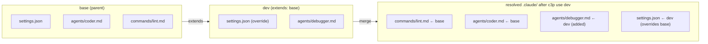

`extends` lets one profile inherit from another. The child profile gets every
file the parent contributes, then layers its own files **on top** — child
files of the same name win.

## Single-parent only

Each profile may extend at most one other profile. If you need multiple
sources, use [`includes`](/docs/concepts/includes/) instead.

```json
// .claude-profiles/dev/profile.json
{
  "extends": "base",
  "description": "local dev — verbose agents, debug commands"
}
```

## How layering works



The child profile (`dev`) inherits every file from `base`, then overrides
any file of the same name.

For a file present in both parent and child, **the child's bytes win** —
parent contributes the file, child overrides it byte-for-byte. Files only
present in the parent flow through unchanged.

`extends` is **transitive**: `dev` → `base` → `core` is allowed. C3P refuses
to resolve a cycle (a profile that extends one of its own descendants) and
exits with code `3`.

## When to reach for `extends`

- You have a **base** set of agents/commands every profile needs (`base`),
  and you want a `dev` and a `ci` profile that each tweak it differently.
- You want **one place** to update a shared rule that propagates to every
  child.

If you instead want to compose unrelated bundles (Python toolchain + Rust
toolchain + shared docs), [`includes`](/docs/concepts/includes/) is the
right tool.

## Verifying the resolved tree

Run [`c3p validate <name>`](/docs/cli/validate/) to dry-run the resolve+merge
without writing anything. Run [`c3p diff <a> <b>`](/docs/cli/diff/) to compare
two profiles' resolved file lists side-by-side.
