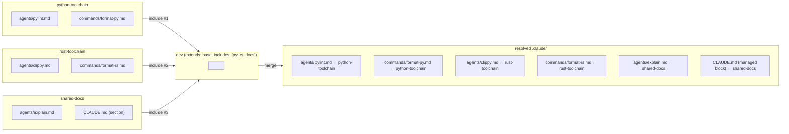

`includes` lets a profile compose **multiple** components additively. Where
[`extends`](/docs/concepts/extends/) is single-parent inheritance,
`includes` is N-way splicing. Components are listed by name, and their
files are folded into the resolved tree in a stable, declared order.

## Authoring

Components live alongside profiles, under `.claude-profiles/<name>/`, but
are referenced by `includes` rather than activated directly:

```json
// .claude-profiles/dev/profile.json
{
  "extends": "base",
  "includes": ["python-toolchain", "rust-toolchain", "shared-docs"]
}
```

Each name resolves to another `.claude-profiles/<name>/` directory whose
files contribute to the resolved tree.

## How splicing works



Each component contributes files; `dev` resolves them in the listed order,
and its own files (if any) win last.

The resolution order is: each `extends` chain first (deepest first), then
each `includes` in declaration order, then the active profile's own files.
**The last contributor wins** when paths collide; the *active* profile is
always last in the chain.

## When to reach for `includes`

- You compose **independent bundles** — a Python toolchain, a Rust
  toolchain, a shared-docs pack — and want to mix-and-match without a
  single inheritance line.
- You want to keep components **reusable** across multiple profiles.

If your relationship is "one base, many tweaks", [`extends`](/docs/concepts/extends/)
is simpler.

## Verifying

Run [`c3p validate <name>`](/docs/cli/validate/) to confirm every include
resolves. Missing includes fail validation with exit code `3`.
